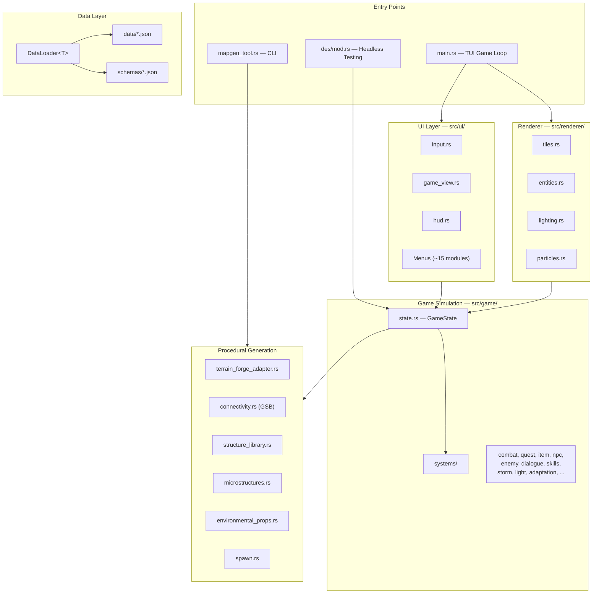
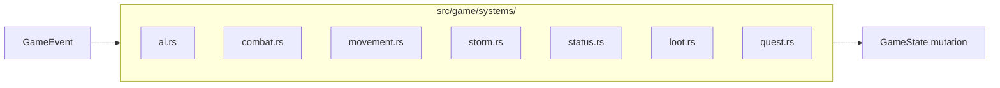
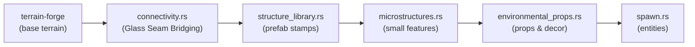
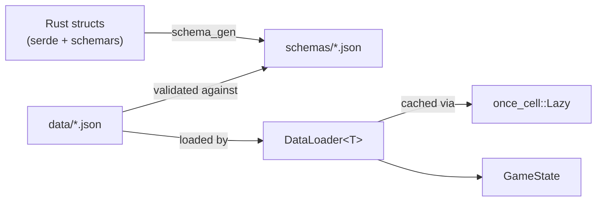
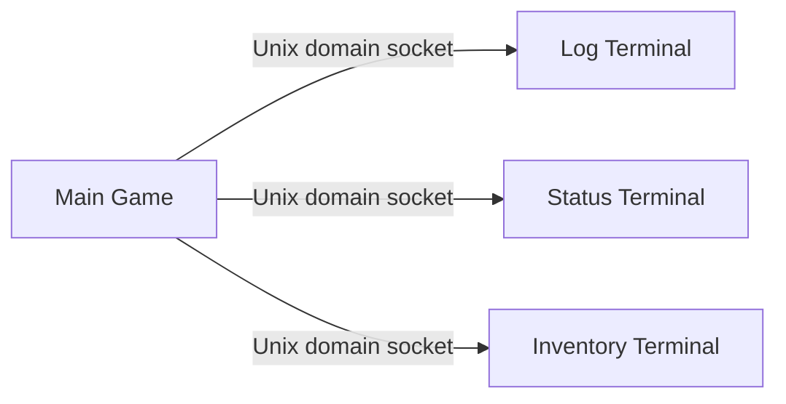

# architecture.md

## System Overview

## Central State Hub

`GameState` in `state.rs` is the single source of truth. Key sub-structs:

| Struct | Responsibility |
|--------|---------------|
| `PlayerState` | Position, HP, inventory, equipment, skills, status effects |
| `WorldState` | World map, current tile map, biome data, discovered locations |
| `NarrativeEngine` | Quest state, dialogue tracking, event history |

All systems read/write through `GameState`. When adding features, you almost certainly need to touch `state.rs`.

## ECS-Style Systems

Systems in `src/game/systems/` are decoupled processors that operate on `GameState`:

Systems communicate via `GameEvent` dispatched through the shared `GameState`. No direct system-to-system calls.

## Generation Pipeline

Tile generation follows a fixed pipeline order:

- **terrain_forge_adapter.rs** bridges the `terrain-forge` crate to game tile types, driven by biome profiles in `data/biome_profiles.json`
- **connectivity.rs** implements Glass Seam Bridging (GSB) — a novel algorithm ensuring all walkable regions connect. Documented in `docs/papers/`
- **constraints.rs** and **quest_constraints.rs** validate post-generation requirements

## Data-Driven Architecture

Cross-reference rules: items ↔ traders, loot_tables, recipes, quests. Enemies ↔ biome_spawn_tables, loot_tables. Adding data entries requires checking all referencing files.

## Deterministic RNG

All RNG uses `ChaCha8Rng` from `rand_chacha` with explicit seeds. `RngState` is serialized with saves. This guarantees: same seed → same world, same combat outcomes, same loot drops.

## Multi-Terminal IPC

`src/ipc.rs` handles socket communication. `src/satellite.rs` runs satellite terminal processes. `src/terminal_spawn.rs` detects and launches terminal emulators.

## Key Architectural Decisions

1. **No ECS framework** — custom systems pattern keeps dependencies lean and code greppable
2. **terrain-forge for base terrain** — adapted via `terrain_forge_adapter.rs` with biome-specific profiles
3. **Glass Seam Bridging** for connectivity — novel algorithm, not a standard flood-fill approach
4. **Schema validation at load time** — all `data/*.json` validated against auto-generated schemas; run `schema_gen` after changing Rust data types
5. **DES for gameplay testing** — headless scenario execution replaces manual TUI testing in CI
