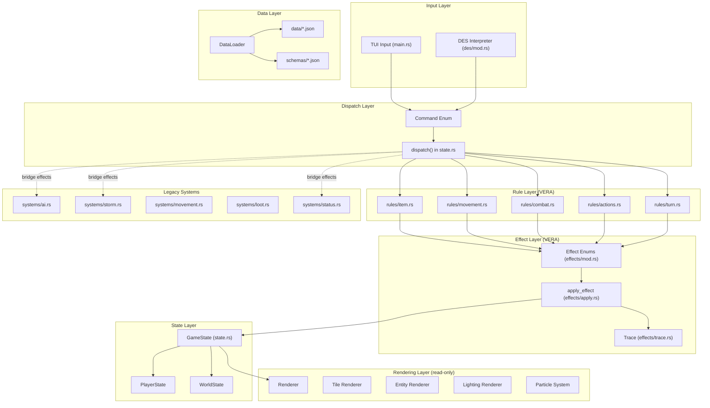
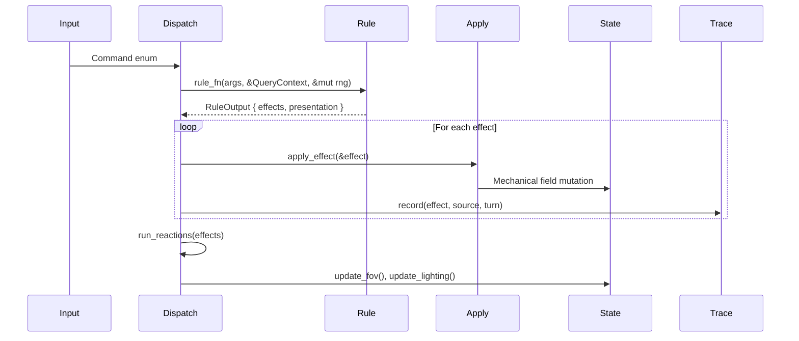
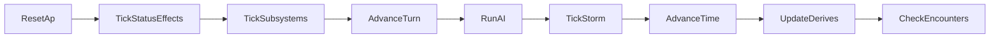
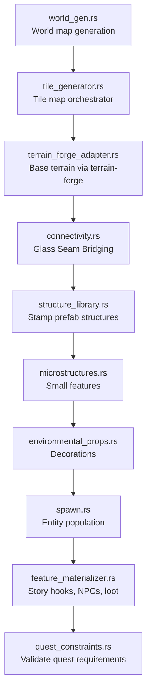
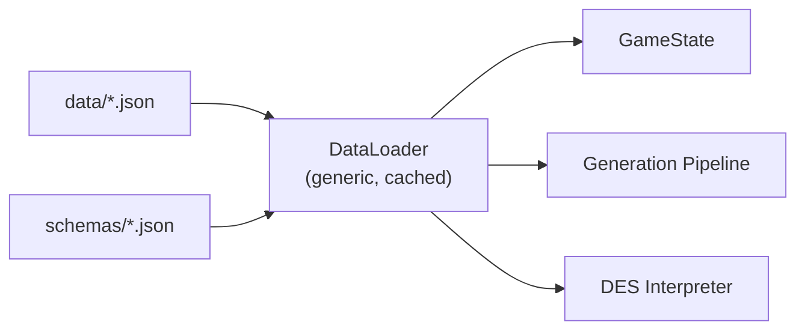
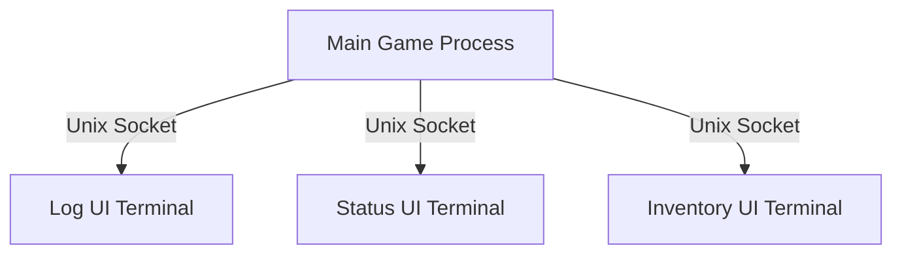

# Architecture

## Overview

Saltglass Steppe is a monolithic Rust application organized in layers. The codebase is actively migrating from imperative state mutation to the VERA (Verified Effect-Rule Architecture) pattern. Both patterns coexist during migration.

## Layer Architecture

## VERA Pattern (Current State)

The VERA migration converts imperative `GameState` methods into a three-step pipeline:

### Migration Status

Systems are in three states:

1. **Fully migrated** (pure rules): item use, movement, combat (melee/ranged), player actions (wait, rest, equip, etc.), world travel
2. **Bridge effects** (traced but calling legacy code): AI system, storm system, status effects, subsystem ticks (psychic, skills, light, void, crystal)
3. **Legacy** (not yet traced): save/load, NPC dialogue, trading, crafting

See `docs/development/SYSTEM_STATUS.md` for the authoritative status of each system.

## Turn Processing

End-of-turn executes a fixed phase sequence:

All phases except UpdateDerives (FOV/lighting recalc) produce traced effects.

## Procedural Generation Pipeline

## Data Flow

All game content is data-driven via JSON files validated against schemas at load time:

## Multi-Terminal Architecture

The game supports satellite terminal windows via IPC:

## Key Design Decisions

- **God object pattern**: `GameState` in `state.rs` is the central hub. All systems access state through it. This is intentional — it's the coordination point.
- **Deterministic RNG**: All randomness uses `ChaCha8Rng` with explicit seeds. Same seed = same gameplay.
- **DES over manual testing**: The Debug Execution System enables headless, deterministic gameplay testing via JSON scenarios.
- **Bridge pattern for migration**: Deeply coupled systems (AI, storm) use bridge effects that call existing code while providing trace visibility.
- **Reactions replace events**: The old `GameEvent` system was replaced by VERA reactions (Batch F). Kill → loot drop → quest progress is now a reaction chain.
