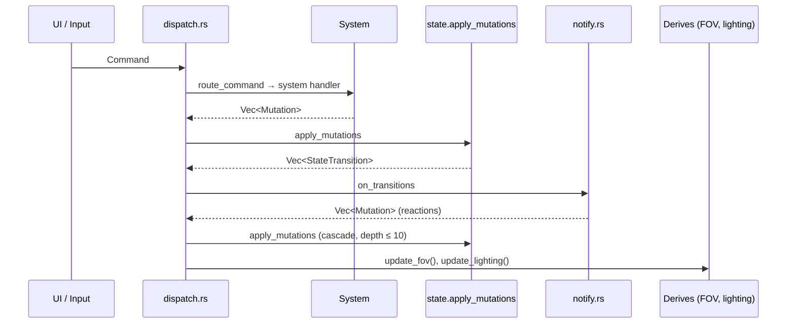
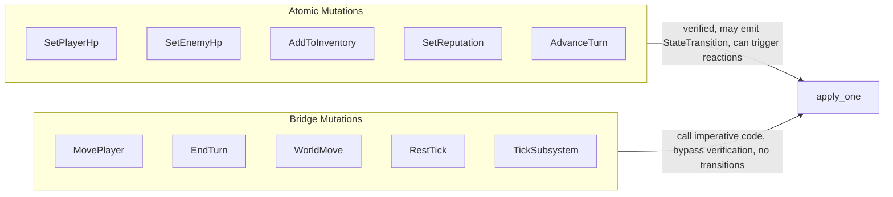
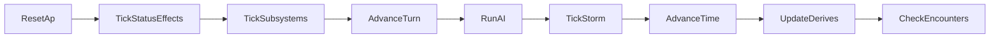
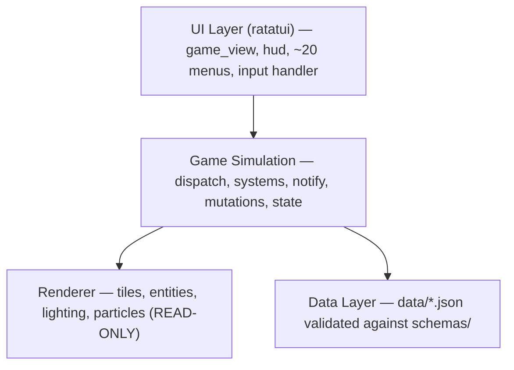

# Architecture

<!-- Generated: 2026-04-06 | tags: architecture, verified-state-store, mutation-engine -->

## Core Pattern: Verified State Store

GameState is a verified data store. It holds all game data, applies mutations with per-field invariant checks, and reports state transitions. It contains zero system logic and zero notification logic.

Three roles:
- **Systems** decide what should change — receive read-only state, return `Vec<Mutation>`
- **State** applies mutations, enforces invariants, reports transitions
- **Notifications** react to transitions — map them to reactive mutations



## Key Files

| File | Role |
|------|------|
| `src/game/state.rs` | GameState struct, `apply_one()` mutation engine, dispatch API, derives |
| `src/game/dispatch.rs` | `route_command()` — routes 22 Command variants to system handlers; `apply_with_cascade()` — cascade loop |
| `src/game/notify.rs` | `on_transitions()` — maps StateTransitions to reactive mutations |
| `src/game/mutations.rs` | `Mutation` enum (~70 variants), `StateTransition` enum (8 variants), `SubsystemId` |
| `src/game/effects/mod.rs` | `Command` enum (22 variants), `Effect` enums (7 domains), `TurnPhase`, `RuleOutput` |
| `src/game/effects/context.rs` | `QueryContext` (read-only state snapshot for systems), `TestContext` (builder for unit tests) |
| `src/game/systems/` | System handler functions — each returns `Vec<Mutation>` |
| `src/game/rules/` | Legacy pure rule functions (being absorbed into `systems/`) |

## Two-Tier Mutation Model



- **Atomic**: Single field assignment with invariant enforcement. May return `StateTransition`. Can trigger reactions via `notify.rs`. Preferred for new features.
- **Bridge**: Call imperative code inside `apply_one`. No transitions emitted. Bypass invariant layer. Pragmatic compromises for complex systems not yet decomposed.
- **Delta**: Relative mutations (`SpendAp`, `AddHp`, `AddSaltScrip`) for when the system doesn't have the current value. Prefer `Set*` variants when possible.
- **Wrapper**: Thin delegation (`Equip` → `SetEquipment`, `RunAI` → `TickSubsystem(AI)`). Readability only.

## State Transitions & Reactions

Transitions are detected inside `apply_one()` by comparing pre/post values:

| Transition | Currently Wired Reaction |
|-----------|--------------------------|
| `EnemyHpChanged` | `combat::on_enemy_hit` — swarm aggro, reflect damage, hit flash |
| `EnemyHpReachedZero` | `combat::on_enemy_killed` — split-on-death, loot drop |
| `PlayerPositionChanged` | Detected but no reaction wired |
| `PlayerApReachedZero` | Detected but no reaction wired |
| `TurnAdvanced` | Detected but no reaction wired |
| `ItemAddedToInventory` | Detected but no reaction wired |
| `PlayerEnteredWorldTile` | Detected but no reaction wired |
| `PlayerDied` | Detected, handled by game loop |

## Invariant Verification

Each mutable field has an invariant enforced inside `apply_one()` (atomic mutations only):

| Field | Invariant |
|-------|-----------|
| `player.hp` | Clamped to `[0, max_hp]` |
| `player.ap` | Clamped to `[0, max_ap]` |
| `player.xp` | Monotonically increasing |
| `player.level` | Clamped to `[1, max_level]` |
| `faction_reputation` | Clamped to `[-100, 100]` |
| `world.time_of_day` | Modulo 24 |

## RNG Handling

All RNG uses `ChaCha8Rng` with explicit seeds for full determinism. Systems use clone-writeback:

```rust
let mut rng = state.rng.clone();
let mutations = system::handle(&ctx, &mut rng);
state.rng = rng;  // write back to advance canonical rng
```

## Turn Processing

`end_turn()` executes 9 phases in fixed order:



All gameplay phases produce traced effects. `UpdateDerives` is FOV/lighting recalc (not traced).

## Layer Separation



## Authoritative References

- **System wiring status**: `docs/development/SYSTEM_STATUS.md` (overrides all other claims)
- **Architecture spec**: `docs/development/architecture_refactor/VERIFIED_STATE_STORE.md`
- **Roadmap**: `docs/development/ROADMAP.md`
