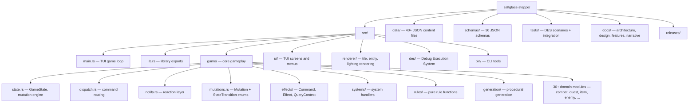

# Codebase Information

<!-- Generated: 2026-04-06 | Commit: c0401a0 -->

## Project

- **Name**: saltglass-steppe
- **Version**: 0.1.0
- **Language**: Rust (Edition 2024)
- **Type**: Single-crate binary + library with two additional binaries (mapgen-tool, schema_gen)
- **License**: See LICENSE

## Metrics

| Metric | Value |
|--------|-------|
| Total source files | ~173 prioritized Rust files |
| Functions | ~1,740 |
| Structs/Enums | ~508 |
| Estimated LOC | ~47,000 |

## Repository Structure

## Build Configuration

- **Release profile**: `codegen-units=1`, `lto=true`, `opt-level=3`, `strip=true`, `panic=abort`
- **Cross-compilation**: Linux → Windows via `x86_64-pc-windows-gnu` + mingw-w64
- **CI**: GitHub Actions — build → test → clippy → fmt, then DES scenarios as separate job

## Key Dependencies

| Crate | Version | Purpose |
|-------|---------|---------|
| ratatui | 0.28 | TUI framework |
| crossterm | 0.28 | Terminal backend |
| terrain-forge | 0.7.0 | Procedural terrain generation |
| bracket-pathfinding | 0.8 | A* pathfinding |
| bracket-noise | 0.8.7 | Perlin/simplex noise |
| serde + serde_json + ron | 1.0 / 0.8 | Serialization |
| rand + rand_chacha | 0.8 / 0.3 | Deterministic RNG |
| vera-effects | 0.1 | Effect-rule architecture types |
| jsonschema | 0.17 | Runtime JSON validation |
| schemars | 0.8 | JSON schema generation from Rust types |

## Entry Points

| Binary | Path | Safe for agents? |
|--------|------|-----------------|
| saltglass-steppe (default) | `src/main.rs` | ❌ Locks terminal |
| mapgen-tool | `src/bin/mapgen_tool.rs` | ✅ CLI output |
| schema_gen | `src/bin/schema_gen.rs` | ✅ Regenerates schemas/ |
