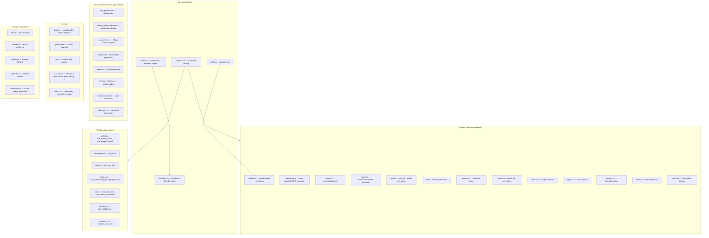

# Components

<!-- Generated: 2026-04-06 | tags: components, subsystems, modules -->

## Component Map

## Core Components

### GameState (`state.rs`)
Central data store. Owns `PlayerState`, `WorldState`, `NarrativeEngine`, `SpatialIndex`, `DebugState`. Provides `dispatch(Command)` as the single entry point. Contains `apply_one()` — the exhaustive match over all Mutation variants with invariant enforcement.

### Dispatch (`dispatch.rs`)
`route_command()` maps 22 Command variants to system handlers. `apply_with_cascade()` runs the apply → transitions → notify → apply cascade loop (depth-limited to 10), then runs derives.

### Notify (`notify.rs`)
`on_transitions()` maps `StateTransition` events to reactive `Vec<Mutation>`. Currently handles `EnemyHpChanged` and `EnemyHpReachedZero` only. Static dispatch (compile-time match arms).

## System Components

### Combat (`systems/combat.rs` + `rules/combat.rs`)
Pure rule functions for melee/ranged attacks. System handles post-processing: swarm aggro, reflect damage, split-on-death, loot drops. Mock system (`combat_always_hit`, `combat_fixed_damage`) for DES testing.

### Movement (`systems/movement.rs` + `rules/movement.rs`)
`rule_move` returns `MoveOutput` with result type (Moved/Npc/Combat/Blocked). Bridge mutation `MovePlayer` handles the full dispatch including NPC interaction, combat delegation, FOV update, and tile effects (glass damage, refraction).

### AI (`systems/ai.rs`)
`AiBehavior` trait with 4 implementations: `StandardMelee`, `RangedOnly`, `Healer`, `SuicideBomber`. Called via bridge `TickSubsystem(AI)`. Enemies act sequentially; spatial index rebuilt between actions.

### Storm (`systems/storm.rs`)
7 edit types: Glass, Rotate, Swap, Mirror, Fracture, Crystallize, Vortex. Called via bridge `TickSubsystem(Storm)`. Spawns wraith enemies on glass tiles. Storm intensity and timing configured in `data/storm_config.json`.

### Turn Processing (`systems/turn.rs`)
`end_turn()` executes 9 `TurnPhase` variants in fixed order. `execute_phase()` maps each phase to mutations. Subsystem ticks (psychic, skills, light, void, crystal) run as bridge effects.

### World Travel (`systems/world.rs`)
Handles overworld movement, tile generation, encounters. `dispatch_world_move` regenerates the tile map via `travel_to_tile`. Encounter system with flee mechanics. Subterranean layer transitions.

### Quest (`game/quest.rs` + `systems/quest.rs`)
Data-driven from `data/quests.json` and `data/main_questline.json`. 7 objective types: Kill, Collect, Reach, Talk, Examine, Interact, Explore. Progress triggered via `QuestNotify` reactions. Auto-complete checking.

## Generation Components

### Tile Generator (`generation/tile_generator.rs`)
Orchestrates the full tile generation pipeline: terrain-forge → connectivity → structures → microstructures → environmental props → spawning → quest constraints.

### Terrain-Forge Adapter (`generation/terrain_forge_adapter.rs`)
Bridges the `terrain-forge` crate. Biome-driven algorithm selection from `data/terrain_config.json`. Algorithm layering with 3 blend modes (replace, overlay, mask). POI-specific layout overrides.

### Connectivity (`generation/connectivity.rs`)
Glass Seam Bridging (GSB) algorithm. Identifies disconnected regions, computes optimal tunnel edges, carves connections. Known issue: not achieving 80% connectivity guarantee for dungeons.

### Settlement (`generation/settlement/`)
Grid-with-jitter layout. 35 building prefabs (14 core + 21 faction-specific). Faction-weighted building selection. NPC spawning from per-building metadata. Road pathfinding between buildings.

## UI Components

### Input Handler (`ui/input.rs`)
Central input dispatch. Maps key events to `Command` variants or UI actions depending on active screen. Handles ~20 different input contexts (gameplay, world map, menus, debug console, look mode).

### Game View (`ui/game_view.rs`)
Main gameplay viewport. Renders map tiles, entities, damage numbers, debug console overlay, death screen. Delegates to renderer for actual tile/entity drawing.

### Menus
~20 menu screens: inventory, skills (canvas-based tree graph), trade, crafting, quest log, faction, psychic, void, crystal, light, debug, wiki, book reader, chest, issue reporter, storm forecast, ARIA interface.

## Renderer Components

Read-only — never mutates GameState. Configurable via `data/render_config.json` and `data/themes.json`.

- **Tiles**: Biome-aware tile appearance, FOV-based visibility, lighting integration
- **Entities**: Player, enemies, NPCs, items with lighting-aware dimming
- **Lighting**: Dynamic light sources, ambient light, glare detection
- **Particles**: Sparkle, glow, float, drift, pulse, shimmer effects
- **Animations**: Screen shake, glow, blink with configurable parameters

## DES Component (`des/mod.rs`)
Debug Execution System interpreter. Parses JSON scenarios, sets up game state, executes actions, evaluates assertions. Supports scenario inheritance, ~50 assertion types, ~30 action types. Mock combat settings for deterministic testing.
