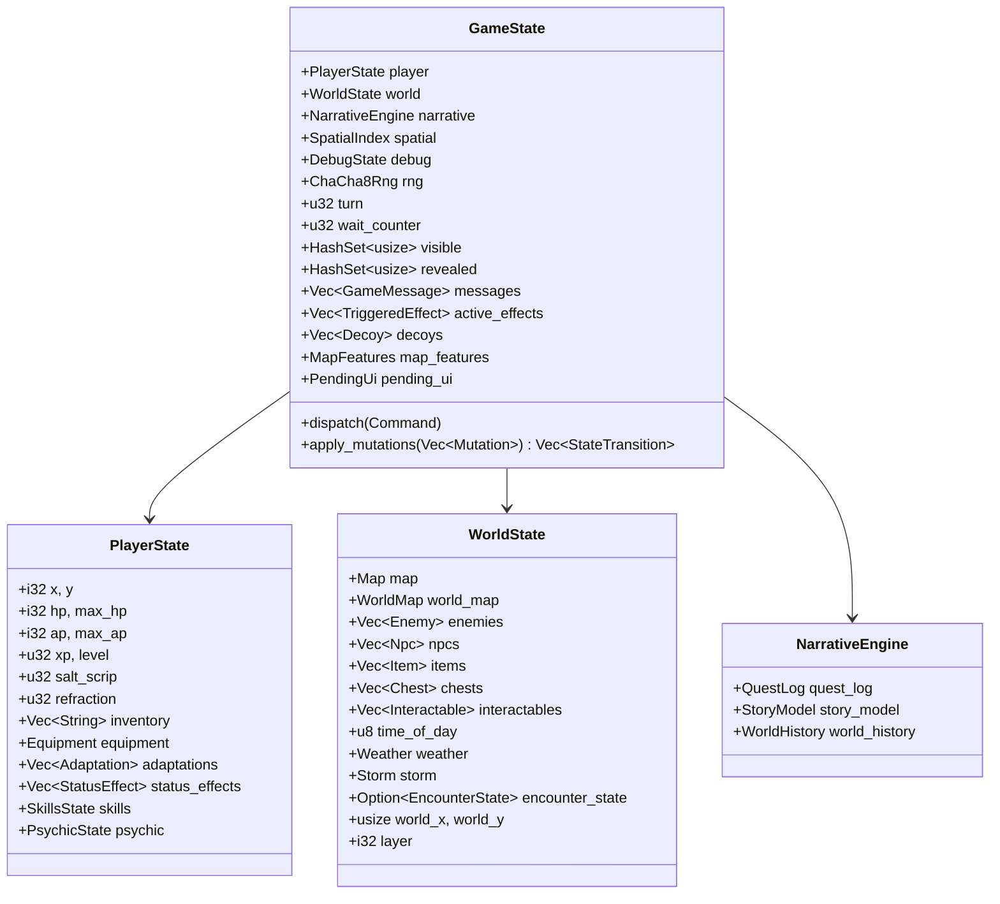
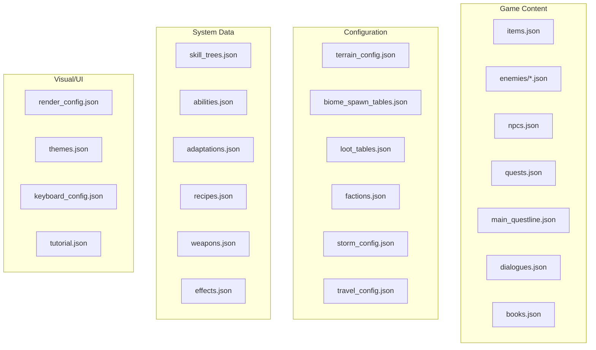

# Data Models

<!-- Generated: 2026-04-06 | tags: data-models, structs, enums, state -->

## GameState (Central Hub)

## Entity Models

### Enemy

| Field | Type | Description |
|-------|------|-------------|
| `id` | `String` | References `data/enemies/*.json` |
| `x`, `y` | `i32` | Map position |
| `hp`, `max_hp` | `i32` | Health |
| `status_effects` | `Vec<StatusEffect>` | Active effects |
| `provoked` | `bool` | Aggro state |

Defined by `EnemyDef` in data: `glyph`, `behavior` (StandardMelee/RangedOnly/Healer/SuicideBomber), `demeanor` (Aggressive/Defensive/Neutral), `faction`, `loot`, `xp_value`, `sight_range`. Split across `data/enemies/{common,uncommon,rare,elite,boss}.json`.

### Npc

| Field | Type | Description |
|-------|------|-------------|
| `id` | `String` | References `data/npcs.json` |
| `x`, `y` | `i32` | Map position |
| `hp`, `max_hp` | `i32` | Health |

Defined by `NpcDef`: `glyph`, `dialogue`, `backstory`, `available_actions` (trade, quest, dialogue, craft).

### Item

| Field | Type | Description |
|-------|------|-------------|
| `id` | `String` | References `data/items.json` |
| `x`, `y` | `i32` | Map position (when on ground) |

Defined by `ItemDef`: `glyph`, `tier`, `consumable`, `pickup`, `effects` (heal, damage, reveal, status), `light_source`, `equip_slot`.

## Map Models

### Map

| Field | Type | Description |
|-------|------|-------------|
| `width`, `height` | `usize` | Dimensions |
| `tiles` | `Vec<Tile>` | Flat grid (row-major) |
| `inscriptions` | `Vec<MapInscription>` | Discoverable text |
| `lights` | `Vec<MapLight>` | Static light sources |

### Tile

| Field | Type | Description |
|-------|------|-------------|
| `glyph` | `char` | Display character |
| `walkable` | `bool` | Movement allowed |
| `transparent` | `bool` | FOV passes through |
| `name` | `String` | Tile type name |
| `wall_hp` | `Option<i32>` | Breakable walls |

### WorldMap

Grid of world tiles with `Biome`, `Terrain`, `POI`, `Resources`, faction territories, and road connections.

## Effect & Mutation Enums

### Effect Domains (7)

| Domain | Key Variants |
|--------|-------------|
| `PlayerEffect` | Heal, TakeDamage, SpendAp, SetPosition, GainXp, RunAI, TickSubsystems |
| `CombatEffect` | DealDamage, Miss, Kill, Provoke, StunEnemy |
| `ItemEffect` | Consume, Equip, Unequip, AddToInventory, SpawnOnMap |
| `MapEffect` | RevealAll, DamageWall, TickStorm, AdvanceTime, SetWeather |
| `ResourceEffect` | GainLightEnergy, GainVoidEnergy, GainResonanceEnergy |
| `EventEffect` | OpenBook, LootDrop, QuestNotify |
| `QuestEffect` | Accept, Complete, SetFactionAlignment |

### Mutation Categories (~70 variants)

| Category | Examples |
|----------|---------|
| Player vitals | `SetPlayerHp`, `SetPlayerAp`, `SetPlayerPosition` |
| Player progression | `SetPlayerXp`, `SetPlayerLevel`, `SetPlayerSaltScrip` |
| Player state | `AddAdaptation`, `AddStatusEffect`, `Equip`, `Unequip` |
| Inventory | `AddToInventory`, `RemoveFromInventory`, `SpawnItemOnMap` |
| Enemies | `SetEnemyHp`, `RemoveEnemy`, `SpawnEnemy`, `StunEnemy` |
| World | `SetTimeOfDay`, `SetWeather`, `AdvanceTurn`, `SetWorldPosition` |
| Map | `SetTile`, `RevealTile`, `RevealAll`, `DamageWall` |
| Encounter | `SetEncounterState`, `SetLastFleeAttempt` |
| Faction/Quest | `SetReputation`, `AcceptQuest`, `CompleteQuest`, `QuestNotify` |
| Resources | `SetLightEnergy`, `AddVoidEnergy`, `SetResonanceEnergy` |
| Presentation | `LogMessage`, `HitFlash`, `DamageNumber`, `SpawnProjectile` |
| Bridge | `MovePlayer`, `EndTurn`, `WorldMove`, `RestTick`, `TickSubsystem` |

## Data Files (JSON)

### Cross-Reference Map

| When modifying... | Also check... |
|-------------------|---------------|
| `items.json` | `traders.json`, `loot_tables.json`, `recipes.json` |
| `enemies/*.json` | `biome_spawn_tables.json`, `loot_tables.json` |
| `npcs.json` | `dialogues.json`, `quests.json` |
| `structures/` | `map_elements.json` |
| Rust data types | Run `cargo run --bin schema_gen` to regenerate schemas |

## Save Format

`SaveFile` envelope with version number + serialized `GameState` in RON format. Current version: v1 (with v2 migration for faction reputation). Stored in `saves/` directory with MD5 checksum for integrity.
