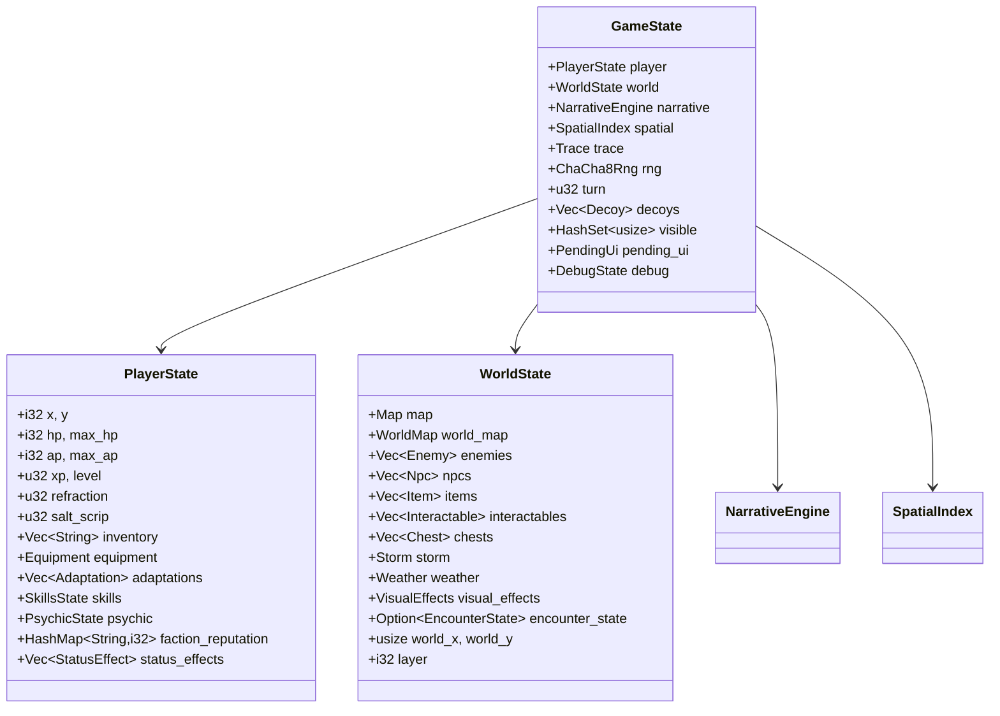
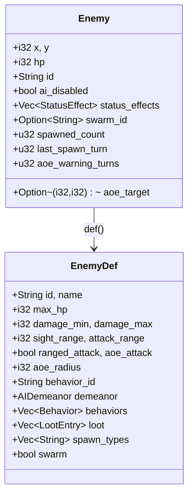
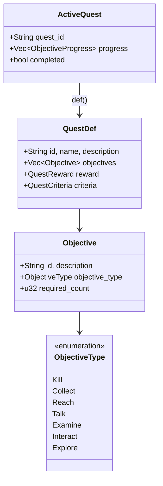
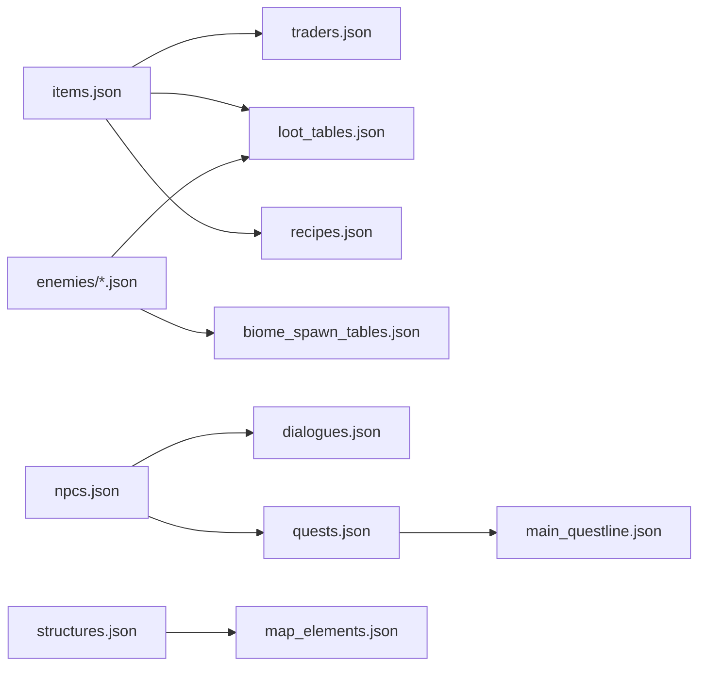

# Data Models

## Core State Structs

### GameState (`src/game/state.rs`)

Top-level game state container:



### SpatialIndex

```rust
pub struct SpatialIndex {
    pub enemy_positions: HashMap<(i32, i32), usize>,
    pub npc_positions: HashMap<(i32, i32), usize>,
    pub item_positions: HashMap<(i32, i32), Vec<usize>>,
}
```

Rebuilt after state mutations via `rebuild_spatial_index()`.

## Entity Models

### Enemy (`src/game/enemy.rs`)



### NPC (`src/game/npc.rs`)

Data-driven via `data/npcs.json`. Has dialogue trees, actions, backstory. Implements `Entity` trait (hp, position, status effects).

### Item (`src/game/item.rs`)

```rust
pub struct Item { pub x: i32, pub y: i32, pub id: String }
pub struct ItemDef {
    pub id: String, pub name: String, pub glyph: char,
    pub usable: bool, pub consumable: bool,
    pub heal: i32, pub reduces_refraction: i32,
    pub reveals_map: bool,
    pub light_energy: u32, pub void_energy: u32, pub resonance_energy: u32,
    pub book_id: Option<String>,
    // weapon stats, tier, effects...
}
```

## Map Models

### Map (`src/game/map.rs`)

```rust
pub struct Map {
    pub tiles: Vec<Tile>,
    pub width: usize,
    pub height: usize,
    pub inscriptions: Vec<MapInscription>,
    pub lights: Vec<MapLight>,
    pub features: Vec<MapFeature>,
}

pub enum Tile {
    Floor { wall_type: String },
    Wall { wall_type: String },
    Glass,
    Glare,
    Water,
    Door,
    StairsDown,
    StairsUp,
    // ...
}
```

Implements `bracket_pathfinding::BaseMap` for A* pathfinding.

### WorldMap (`src/game/world_map.rs`)

```rust
pub struct WorldMap {
    pub tiles: Vec<Vec<WorldTile>>,  // 2D grid
    pub width: usize,
    pub height: usize,
}
// WorldTile has: Biome, Terrain, Option<POI>, Resources, faction territory
```

## Quest Models (`src/game/quest.rs`)



## Combat Models (`src/game/combat.rs`)

```rust
pub struct WeaponDef {
    pub id: String, pub name: String,
    pub damage_min: i32, pub damage_max: i32,
    pub accuracy: i32, pub ap_cost: i32,
    pub range: i32,
}

pub enum CombatResult { Hit { damage: i32 }, Miss, Kill }
```

Hit chance: `base_accuracy + weapon_accuracy + skill_bonus - enemy_evasion`, clamped 5%–95%.
Damage: `roll(min..=max) + strength_bonus - armor`, minimum 1.

## Storm Models (`src/game/storm.rs`)

```rust
pub struct Storm {
    pub intensity: u8,        // 1-10
    pub countdown: u32,       // turns until storm fires
    pub edit_types: Vec<StormEditType>,
}

pub enum StormEditType {
    Glass, Rotate, Swap, Mirror, Fracture, Crystallize, Vortex
}
```

## Status Effects (`src/game/status.rs`)

```rust
pub struct StatusEffect {
    pub id: String,
    pub remaining_turns: i32,
    pub stacks: u32,
}
// Effects: poison (damage/turn), stun (skip turn), slow (AP penalty), etc.
```

## Data File Cross-References



## Serialization

- Game state: `serde_json` for save files
- Data files: `serde_json` for JSON, `ron` for RON configs
- Schemas: `schemars` for auto-generation from Rust types
- Save format includes MD5 checksum and version number for migration
