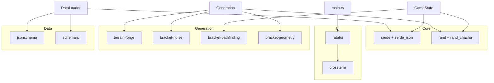

# Dependencies

## Runtime Dependencies

### UI & Terminal
| Crate | Version | Purpose |
|-------|---------|---------|
| `ratatui` | 0.28 | TUI framework — multi-panel layouts, widgets |
| `crossterm` | 0.28 | Cross-platform terminal backend |

### Data & Serialization
| Crate | Version | Purpose |
|-------|---------|---------|
| `serde` | 1.0 | Serialization framework (with `derive` feature) |
| `serde_json` | 1.0 | JSON parsing for data files and saves |
| `ron` | 0.8 | Rusty Object Notation for some config files |
| `jsonschema` | 0.17 | JSON schema validation at data load time |
| `schemars` | 0.8 | Auto-generate JSON schemas from Rust types (with `derive` feature) |

### Procedural Generation
| Crate | Version | Purpose |
|-------|---------|---------|
| `terrain-forge` | 0.7.0 | 2D procedural terrain generation (exclusive terrain backend) |
| `bracket-noise` | 0.8.7 | Perlin/simplex noise for terrain variation |
| `bracket-pathfinding` | 0.8 | A* pathfinding for enemies and connectivity |
| `bracket-geometry` | 0.8.7 | Geometric utilities (line drawing, distance) |
| `bracket-algorithm-traits` | 0.8.7 | Trait definitions for bracket-lib integration |

### RNG
| Crate | Version | Purpose |
|-------|---------|---------|
| `rand` | 0.8 | Random number generation traits |
| `rand_chacha` | 0.3 | ChaCha8Rng — deterministic, seedable RNG |

### Utilities
| Crate | Version | Purpose |
|-------|---------|---------|
| `once_cell` | 1.0 | Lazy static initialization (behavior registry, data caches) |
| `rayon` | 1.11 | Data parallelism (used in generation) |
| `textwrap` | 0.16 | Text wrapping for UI panels |
| `chrono` | 0.4 | Date/time for save file metadata (with `serde` feature) |
| `clap` | 4.0 | CLI argument parsing (with `derive` feature) |
| `which` | 6.0 | Terminal emulator detection for satellite windows |
| `image` | 0.25 | Image processing (map exports) |
| `smallvec` | 1.15 | Stack-allocated vectors for performance-sensitive paths |
| `md5` | 0.8 | Save file checksum computation |

### VERA
| Crate | Version | Purpose |
|-------|---------|---------|
| `vera-effects` | 0.1 | RuleOutput type definition for VERA pattern |

## Dependency Graph (Key Relationships)

## Notable Dependency Patterns

- **terrain-forge is the exclusive terrain backend**: All procedural terrain generation goes through `terrain_forge_adapter.rs`. Dead custom algorithms (BSP, maze, voronoi, WFC) exist but are unused.
- **bracket-pathfinding for A***: Used by enemy AI and connectivity analysis. `Map` implements `BaseMap` trait.
- **Deterministic RNG everywhere**: `ChaCha8Rng` is the only RNG used. Never use `thread_rng()` or `OsRng`.
- **schemars for schema generation**: Run `cargo run --bin schema_gen` after changing data struct definitions to regenerate `schemas/`.
