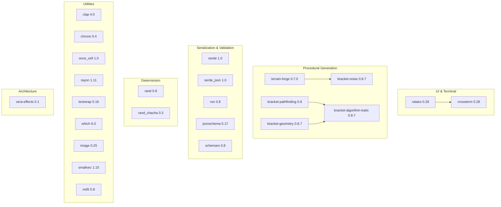

# Dependencies

<!-- Generated: 2026-04-06 | tags: dependencies, crates, external -->

## Dependency Graph

## Dependency Details

### UI & Terminal

| Crate | Version | Usage |
|-------|---------|-------|
| `ratatui` | 0.28 | TUI framework — multi-panel layouts, widgets, styled text. Used by all `ui/` modules and `renderer/` |
| `crossterm` | 0.28 | Terminal backend — raw mode, event polling, cursor control. Used by `main.rs` for terminal setup |

### Procedural Generation

| Crate | Version | Usage |
|-------|---------|-------|
| `terrain-forge` | 0.7.0 | 2D procedural terrain generation. Primary algorithm provider for tile maps via `terrain_forge_adapter.rs`. Supports cellular automata, BSP, rooms, noise-based generation |
| `bracket-pathfinding` | 0.8 | A* pathfinding for AI movement, auto-explore, road generation. Also provides shadowcasting FOV |
| `bracket-noise` | 0.8.7 | Perlin/simplex noise for terrain variation, biome blending |
| `bracket-geometry` | 0.8.7 | Geometric utilities — Point, Rect, line-of-sight, distance calculations |
| `bracket-algorithm-traits` | 0.8.7 | Trait definitions shared by bracket-* crates (BaseMap, Algorithm2D) |

### Serialization & Validation

| Crate | Version | Usage |
|-------|---------|-------|
| `serde` | 1.0 (derive) | Serialization framework — `#[derive(Serialize, Deserialize)]` on all data types |
| `serde_json` | 1.0 | JSON parsing for `data/*.json` content files and DES scenarios |
| `ron` | 0.8 | RON format for save files (`saves/*.ron`) and meta-progress |
| `jsonschema` | 0.17 | Runtime JSON schema validation in `DataLoader` — validates data files against `schemas/*_v1.json` |
| `schemars` | 0.8 (derive) | JSON schema generation from Rust types — `cargo run --bin schema_gen` produces `schemas/` |

### Determinism

| Crate | Version | Usage |
|-------|---------|-------|
| `rand` | 0.8 | RNG traits and distributions. All randomness goes through seeded RNG |
| `rand_chacha` | 0.3 | `ChaCha8Rng` — cryptographic-quality PRNG with deterministic output from seed. Core to the determinism guarantee |

### Architecture

| Crate | Version | Usage |
|-------|---------|-------|
| `vera-effects` | 0.1 | Provides `RuleOutput<E, P>` type used by rule functions. Lightweight architecture support crate |

### Utilities

| Crate | Version | Usage |
|-------|---------|-------|
| `clap` | 4.0 (derive) | CLI argument parsing — `--log-ui`, `--status-ui`, `--inventory-ui` modes in `cli.rs` |
| `chrono` | 0.4 (serde) | Date/time for save file timestamps and local time formatting |
| `once_cell` | 1.0 | Lazy static initialization for data caches (enemy defs, item defs, etc.) |
| `rayon` | 1.11 | Data parallelism — used in generation pipeline for parallel constraint validation |
| `textwrap` | 0.16 | Text wrapping for UI panels, dialogue boxes, book reader |
| `which` | 6.0 | Terminal emulator detection for multi-terminal IPC spawning |
| `image` | 0.25 | Image processing for map export functionality |
| `smallvec` | 1.15 | Stack-allocated vectors for hot paths (particle systems, spatial queries) |
| `md5` | 0.8 | Save file integrity checksums |

### Dev Dependencies

| Crate | Version | Usage |
|-------|---------|-------|
| `tempfile` | 3.24 | Temporary directories for save/load round-trip tests |

## Dependency Relationships

Key integration points where external crates shape the architecture:

- **terrain-forge** → `terrain_forge_adapter.rs`: The adapter translates between terrain-forge's output format and the game's `Tile` type. Biome profiles in `terrain_config.json` configure which terrain-forge algorithms to use per biome.
- **bracket-pathfinding** → `map.rs`, `systems/ai.rs`, `auto_explore.rs`: Map implements `BaseMap` and `Algorithm2D` traits for A* and FOV. AI uses A* for enemy pathfinding.
- **serde + ron** → `save.rs`: GameState serialization uses RON format. All game data types derive `Serialize`/`Deserialize`.
- **jsonschema + schemars** → `data_loader.rs`, `bin/schema_gen.rs`: Schema generation from Rust types, runtime validation at data load time.
- **rand_chacha** → `state.rs`, all systems: `ChaCha8Rng` is the single RNG source. Clone-writeback pattern in dispatch ensures determinism.
