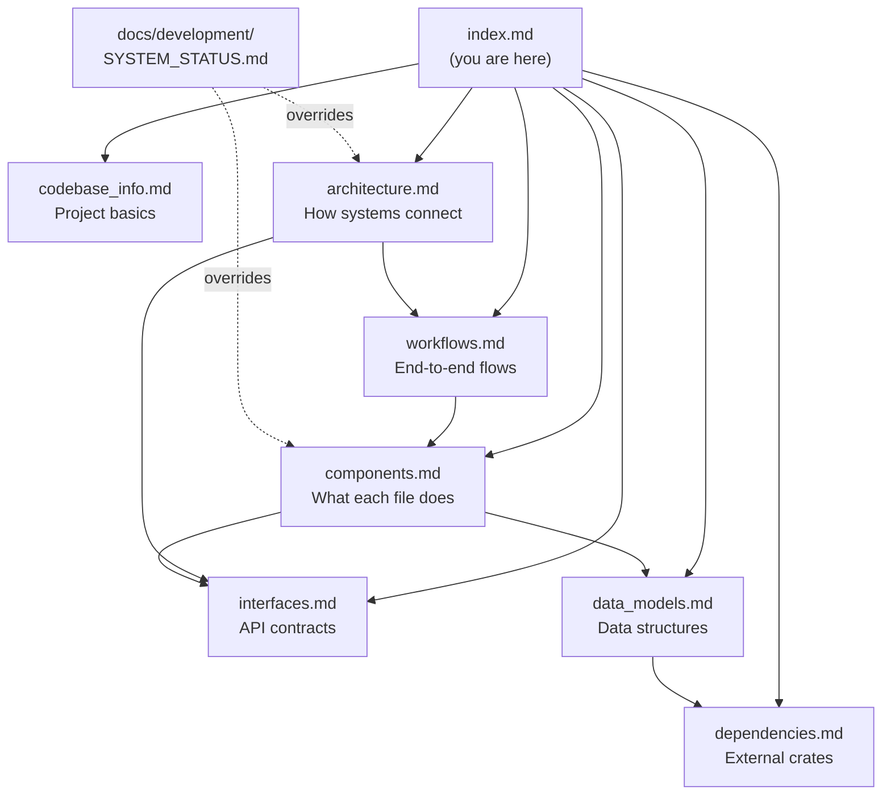

# Documentation Index

> **For AI assistants**: This file is your primary entry point. Read it first to understand what documentation exists and where to find detailed information. You should rarely need to read all files — use the summaries below to determine which file answers your question.

## How to Use This Documentation

1. **Start here** — scan the file summaries below to find relevant docs
2. **Check SYSTEM_STATUS.md first** — before working on any gameplay system, read `docs/development/SYSTEM_STATUS.md`. It's the source of truth for what's wired into gameplay
3. **Use AGENTS.md for navigation** — it has the directory map and repo-specific patterns
4. **Dive into specific files** only when you need implementation details

## File Index

| File | What It Contains | Read When... |
|------|-----------------|--------------|
| [codebase_info.md](codebase_info.md) | Project identity, repo structure, build commands | You need project basics or how to build/test |
| [architecture.md](architecture.md) | VERA pattern, layer diagram, turn processing, generation pipeline, multi-terminal IPC | You need to understand how systems connect or the VERA dispatch flow |
| [components.md](components.md) | All major components: effects, rules, systems, generation, UI, renderer, DES, domain modules | You need to find which file implements a specific feature |
| [interfaces.md](interfaces.md) | Command enum (22 variants), Effect enum (7 domains), QueryContext, TestContext, System trait, DES API, DataLoader | You need to understand API contracts or add new commands/effects |
| [data_models.md](data_models.md) | GameState hierarchy, entity models (Enemy, NPC, Item), map models, quest models, combat formulas, data cross-references | You need to understand data structures or add new entity types |
| [workflows.md](workflows.md) | Player action flow, end-of-turn sequence, combat flow, reaction chains, world travel, map generation, DES execution, save/load, CI | You need to trace how a specific gameplay flow works end-to-end |
| [dependencies.md](dependencies.md) | 27 crate dependencies with versions and purposes, dependency graph | You need to understand external libraries or add new dependencies |

## Quick Reference: Common Tasks

| Task | Start With |
|------|-----------|
| Add a new player action | interfaces.md (Command enum) → architecture.md (VERA pattern) |
| Add a new enemy type | data_models.md (EnemyDef) → components.md (spawn system) |
| Add a new item | data_models.md (ItemDef) → dependencies.md (cross-references) |
| Fix a combat bug | workflows.md (combat flow) → components.md (combat system) |
| Add a DES test scenario | interfaces.md (DES API) → workflows.md (DES execution) |
| Understand turn processing | workflows.md (end-of-turn) → architecture.md (TurnPhase) |
| Add a new UI menu | components.md (UI components) → dependencies.md (ratatui) |
| Modify map generation | workflows.md (map gen flow) → components.md (generation pipeline) |
| Add a new effect variant | interfaces.md (Effect enum) → architecture.md (VERA pattern) |
| Understand the reaction system | workflows.md (reaction chain) → architecture.md (reactions) |

## External Documentation

These files live outside `.agents/summary/` but are critical references:

| File | Purpose |
|------|---------|
| `docs/development/SYSTEM_STATUS.md` | **Source of truth** for system wiring status. Read before working on any system. |
| `docs/development/architecture_refactor/FINAL_ARCHITECTURE.md` | Full VERA design document with rationale |
| `docs/development/architecture_refactor/VERA_FULL_MIGRATION.md` | Migration plan with batch descriptions |
| `AGENTS.md` | Agent navigation guide with directory map, patterns, Custom Instructions |
| `README.md` | Project overview, setup, usage |

## Relationships Between Files

The `SYSTEM_STATUS.md` registry overrides claims in these summary files. If a summary says a system is functional but the registry says ❌, trust the registry.
