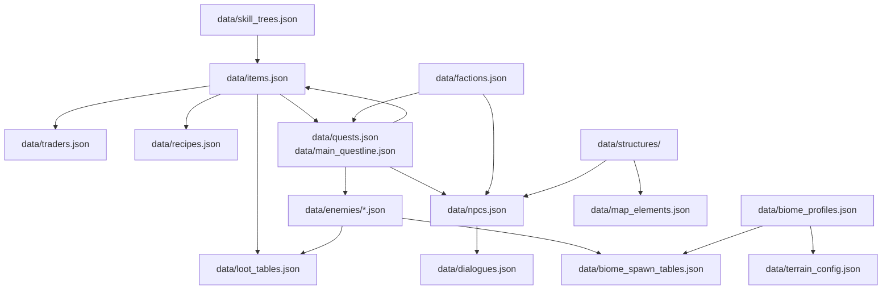

# Interfaces & Integration Points

> Updated 2026-04-04 after cleanup.

## DataLoader\<T\> (`src/game/data_loader.rs`)

Generic loader for JSON data files with schema validation.

```rust
pub trait HasId { fn id(&self) -> &str; }

pub struct DataLoader<T> { data: HashMap<String, T> }

impl<T: DeserializeOwned + HasId> DataLoader<T> {
    fn load_single(source: DataSource, list_key: &str, expected_schema: &str) -> Self;
    fn load_multiple(sources: &[DataSource], list_key: &str, expected_schema: &str) -> Self;
    fn from_map(data: HashMap<String, T>) -> Self;
    fn get(&self, id: &str) -> Option<&T>;
    fn all(&self) -> Vec<&T>;
    fn ids(&self) -> Vec<&str>;
}
```

Schema validation runs at load time against `schemas/*_v1.json`. Supported schemas: `enemies_v1`, `items_v1`, `weapons_v1`, `quests_v1`, `npcs_v1`. Panics on duplicate IDs, missing schema fields, or validation failures.

## Game Systems (`src/game/systems/`)

All systems implement the `System` trait:

```rust
pub trait System {
    fn update(&self, state: &mut GameState);
    fn on_event(&self, state: &mut GameState, event: &GameEvent);
}
```

Concrete systems: `ai`, `combat`, `movement`, `storm`, `status`, `loot`, `quest`. Called during turn processing in `state.rs`.

## Procedural Generation (`src/game/generation/`)

### Algorithm Interface (`algorithm.rs`)

```rust
pub trait GenerationAlgorithm: Send + Sync {
    fn generate(&self, context: &AlgorithmContext) -> Result<GenerationResult, GenerationError>;
    fn parameters(&self) -> &AlgorithmParameters;
    fn validate_context(&self, context: &AlgorithmContext) -> Result<(), ValidationError>;
    fn algorithm_id(&self) -> &str;
    fn display_name(&self) -> &str;
}
```

- `AlgorithmContext`: width, height, seed, biome, poi_type, input_layers, parameters, quest_ids, metadata.
- `GenerationResult`: output_layers (HashMap of `GenerationLayer`), metadata, warnings.

### Terrain Forge Adapter (`terrain_forge_adapter.rs`)

```rust
impl TerrainForgeGenerator {
    pub fn new() -> Self;
    pub fn generate_tile_with_seed(
        &self, biome: Biome, terrain: Terrain, elevation: u8,
        poi: POI, seed: u64, quest_ids: &[String],
    ) -> (Map, GenerationMetadata);
}
```

All tile terrain generation goes through this adapter. Custom algorithms were removed.

### Tile Generator (`tile_generator.rs`)

```rust
pub struct TileParams {
    pub seed: u64, pub biome: Biome, pub terrain: Terrain,
    pub elevation: u8, pub poi: POI, pub level: u32,
    pub faction_control: Vec<(String, f32)>, pub quest_ids: Vec<String>,
}

pub struct GeneratedTile {
    pub map: Map, pub enemies: Vec<Enemy>, pub npcs: Vec<Npc>,
    pub items: Vec<Item>, pub chests: Vec<Chest>,
    pub spawn_pos: (i32, i32), pub walkable_positions: Vec<(i32, i32)>,
}

pub fn generate_tile(params: &TileParams) -> GeneratedTile;
```

### Constraint Validation (`constraints.rs`)

- `validate_constraints()` — run all rules against generated map
- `are_critical_constraints_satisfied()` — hard requirements only
- `calculate_satisfaction_score()` — soft quality score (0.0–1.0)

## DES Scenario Format (`tests/scenarios/*.json`)

```json
{
  "name": "scenario_name",
  "inherits": "BASE_combat",
  "seed": 12345,
  "map_setup": { "width": 20, "height": 20, "clear_area": { "x": 0, "y": 0, "w": 20, "h": 20 } },
  "player": { "x": 5, "y": 5, "hp": 100 },
  "entities": [{ "type": "enemy", "id": "salt_crawler", "x": 7, "y": 5 }],
  "mocks": { "combat_always_hit": true, "combat_fixed_damage": 10 },
  "actions": [{ "actor": "player", "action": "attack", "direction": "east" }],
  "assertions": [{ "check": "enemy_hp", "index": 0, "op": "<", "value": 100, "at_end": true }]
}
```

Key actions: `move`, `attack`, `wait`, `use_item`, `equip`, `teleport`, `interact`, `rest`, `ranged_attack`, `log`.
Assertions: player HP/AP/position, enemy state, inventory contents, quest progress, map state.
Inheritance: `BASE_*` files provide reusable setups.

## IPC (`src/ipc.rs`)

Multi-terminal communication via Unix domain sockets (unix-only).

```rust
pub enum IpcMessage {
    GameState { hp, max_hp, refraction, turn, storm_countdown, adaptations, god_view, phase_mode },
    LogEntry { message, msg_type, turn },
    InventoryUpdate { items, equipped },
    DebugInfo { player_pos, enemies_count, items_count, storm_intensity, seed, ... },
    Command { action },
}

pub struct IpcServer { /* accepts clients, broadcasts messages */ }
pub struct IpcClient { /* connects, reads messages */ }
```

Messages are JSON-serialized, sent line-delimited over the socket. Non-blocking broadcast to prevent game lag.

## Save/Load (`src/game/save.rs`)

```rust
pub fn save_game(state: &GameState) -> Result<PathBuf, String>;
pub fn load_game(path: impl AsRef<Path>) -> Result<GameState, String>;
pub fn list_saves() -> Vec<SaveInfo>;
```

- Format: RON serialization of `SaveFile { version, state }`.
- Integrity: filename is MD5 hash of content. `compute_hash()` detects tampering.
- Migration: `migrate_save(state, from_version)` handles version upgrades (currently v1→v2→v3).
- Metadata: `saves/meta.json` tracks status (Ok/HashMismatch/Corrupt), character name, save time.

## Rendering (`src/renderer/mod.rs`)

```rust
impl Renderer {
    pub fn new() -> Result<Self, Box<dyn std::error::Error>>;
    pub fn render_game(
        &mut self, frame: &mut Frame, area: Rect, state: &GameState,
        frame_count: u64, look_cursor: Option<(i32, i32)>, pause_particles: bool,
    );
    pub fn reload_config(&mut self) -> Result<(), Box<dyn std::error::Error>>;
    pub fn add_particle_effect(&mut self, x: f32, y: f32, effect_type: ParticleType);
    pub fn add_screen_shake(&mut self);
    pub fn set_theme(&mut self, theme_name: &str) -> bool;
    pub fn set_fps(&mut self, fps: u32);
}
```

Pipeline: camera update → particle/animation update → lighting calculation → tile rendering → entity rendering → effects compositing → particle overlay → procedural effects → look cursor → frame output.

Config loaded from `data/render_config.json`, themes from `data/themes.json`, effects from `data/effects.json`.

## Data Cross-Reference Graph



When adding or modifying data entries, verify all cross-references are valid. Run `cargo run --bin schema_gen` if Rust types changed.
