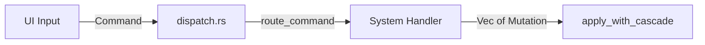
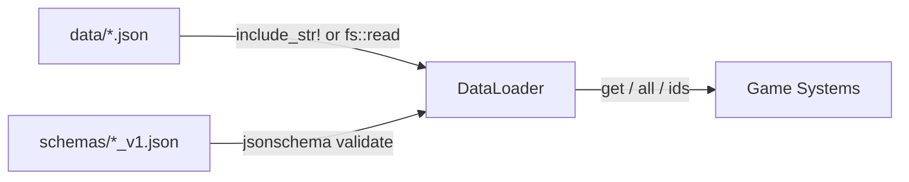
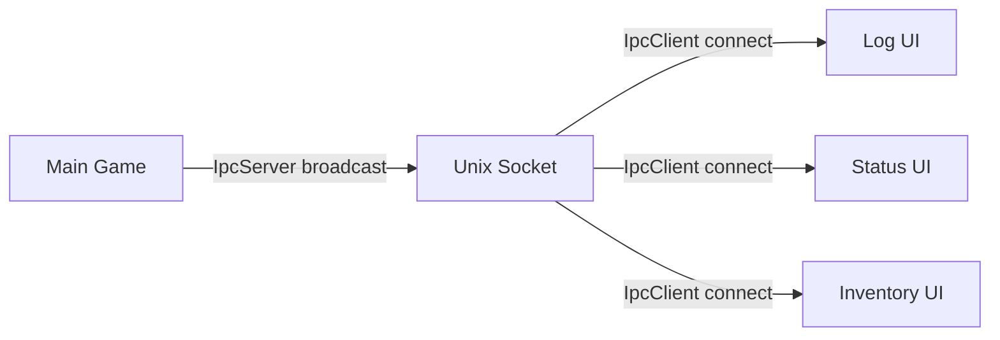

# Interfaces

<!-- Generated: 2026-04-06 | tags: interfaces, apis, integration-points -->

## Command Interface

The primary API for all gameplay actions. UI dispatches `Command` variants through `state.dispatch()`.



### Command Variants (22 total)

| Command | Routed To | Returns |
|---------|-----------|---------|
| `Move { dx, dy }` | `movement::handle_move` | Bridge: `MovePlayer` |
| `Attack { target_x, target_y }` | `combat::handle_melee` | Atomic mutations |
| `RangedAttack { target_x, target_y }` | `combat::handle_ranged` | Atomic mutations |
| `UseItem { index }` | `items::handle_use_item` | Atomic mutations |
| `UseItemOnTile { index, x, y }` | `items::handle_use_item_on_tile` | Atomic mutations |
| `Wait` | `player::handle_wait` + `EndTurn` | Atomic + bridge |
| `Rest` | `player::handle_rest` + `RestTick` | Atomic + bridge |
| `Equip { inv_idx, slot }` | `player::handle_equip` | Atomic mutations |
| `Unequip { slot }` | `player::handle_unequip` | Atomic mutations |
| `AllocateStat { stat }` | `player::handle_allocate_stat` | Atomic mutations |
| `AcceptQuest { quest_id }` | `quest::handle_accept_quest` | Atomic mutations |
| `CompleteQuest { quest_id }` | `quest::handle_complete_quest` | Atomic mutations |
| `Interact { x, y }` | `interact::handle_interact` | Atomic mutations |
| `Examine { x, y }` | `interact::handle_examine` | Atomic mutations |
| `UsePsychic { ability_id }` | Bridge: `UsePsychicAbility` | Bridge mutation |
| `FleeEncounter` | `player::handle_flee_encounter` | Atomic mutations |
| `WorldMove { new_wx, new_wy }` | Bridge: `WorldMove` | Bridge mutation |
| `WorldMoveSafe { new_wx, new_wy }` | Bridge: `WorldMoveSafe` | Bridge mutation |
| `FollowWorldPath` | Bridge: `FollowWorldPath` | Bridge mutation |
| `CalculateWorldPath { target }` | Bridge: `CalculateWorldPath` | Bridge mutation |
| `EnterSubterranean` | Bridge: `EnterSubterranean` | Bridge mutation |
| `ExitSubterranean` | Bridge: `ExitSubterranean` | Bridge mutation |

### Commands with Return Values (bypass dispatch)

Three commands return values the UI needs and are called directly on GameState:

| Method | Returns | Why |
|--------|---------|-----|
| `dispatch_craft(recipe_id)` | `bool` | UI needs success/failure |
| `dispatch_buy_item(item_id, npc_id)` | `Result<(), String>` | UI needs error message |
| `dispatch_sell_item(item_id)` | `Result<(), String>` | UI needs error message |

## System Handler Interface

Two signatures used by system functions:

### Command Handlers
Called from `dispatch.rs`, receive read-only `QueryContext`:

```rust
pub fn handle_melee(x: i32, y: i32, query: &QueryContext, rng: &mut ChaCha8Rng) -> Vec<Mutation>
```

### Notification Handlers
Called from `notify.rs`, receive read-only `&GameState`:

```rust
pub fn on_enemy_hit(state: &GameState, idx: usize, old_hp: i32, new_hp: i32) -> Vec<Mutation>
```

Both return `Vec<Mutation>`. Neither mutates state directly.

## QueryContext Interface

Read-only snapshot of game state provided to system handlers:

| Field | Type | Description |
|-------|------|-------------|
| `player` | `&PlayerState` | Player vitals, inventory, equipment, position |
| `map` | `&Map` | Tile map with walkability, opacity |
| `enemies` | `&[Enemy]` | All enemies on current map |
| `enemy_positions` | `&HashMap<(i32,i32), usize>` | Spatial index for enemies |
| `npc_positions` | `&HashMap<(i32,i32), usize>` | Spatial index for NPCs |
| `visible` | `&HashSet<usize>` | FOV-visible tile indices |
| `mock_combat_hit` | `Option<bool>` | DES mock override |
| `mock_combat_damage` | `Option<i32>` | DES mock override |
| `turn` | `u32` | Current turn number |
| `time_of_day` | `u8` | 0–23 hour |

### TestContext Builder

For unit testing rules without a full GameState:

```rust
let ctx = TestContext::new()
    .with_player_hp(50)
    .with_player_ap(4)
    .with_floor_at(6, 5)
    .with_enemy(enemy)
    .with_mock_combat_hit(true)
    .build();
```

## Data Loading Interface

### DataLoader<T>

Generic loader for JSON data files with schema validation:



- `load_single(source)` — load one file
- `load_multiple(sources)` — load multiple files into one map
- `get(id)` / `all()` / `ids()` — query loaded data
- Schema validation at load time via `jsonschema` crate

## IPC Interface (Multi-Terminal)

Unix domain socket IPC for satellite terminal windows:



| Message Type | Direction | Content |
|-------------|-----------|---------|
| `GameStateData` | Server → Client | Player stats, inventory, log messages |
| `InventoryData` | Server → Client | Detailed inventory for inventory-ui |

## DES Scenario Interface

JSON-based test scenarios consumed by `DesExecutor`:

| Field | Type | Description |
|-------|------|-------------|
| `name` | string | Scenario identifier |
| `inherits` | string? | Parent scenario for inheritance |
| `seed` | u64 | RNG seed for determinism |
| `map_setup` | object | Map dimensions, clear areas, ensure paths |
| `player` | object | Player position, HP, AP, inventory, equipment |
| `entities` | array | Enemy/NPC/item spawns |
| `mocks` | object | Combat mock overrides |
| `actions` | array | Sequence of player/scheduled actions |
| `assertions` | array | State checks with comparison operators |

~50 assertion types, ~30 action types. Dispatches via `Command` for migrated actions.

## Renderer Interface

Read-only access to GameState. Never mutates state.

| Component | Input | Output |
|-----------|-------|--------|
| `TileRenderer` | `&Map`, `&HashSet<usize>` (visible), `&LightMap` | Styled tile cells |
| `EntityRenderer` | `&[Enemy]`, `&[Npc]`, `&[Item]`, `&LightMap` | Styled entity cells |
| `LightingRenderer` | `&Map`, light sources | `LightMap` grid |
| `ParticleSystem` | Spawn commands | Animated particle cells |

Configurable via `data/render_config.json` and `data/themes.json`.
