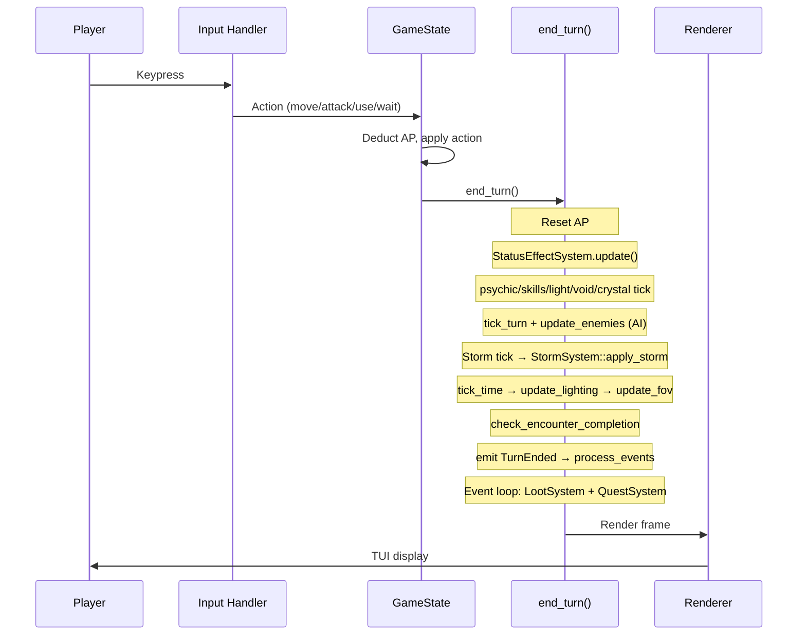
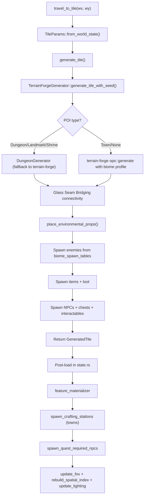
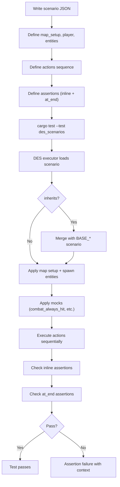
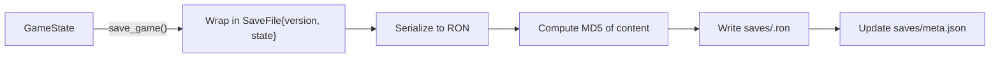
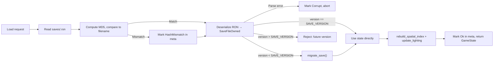
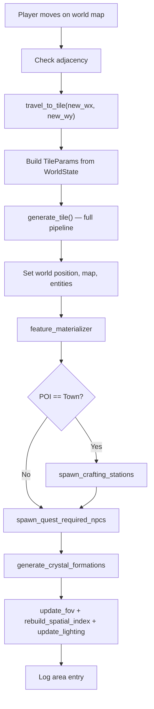
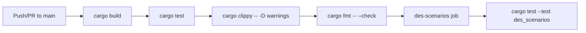

# Workflows

## Game Turn Loop

Input → Action → state mutation → `end_turn()` → Render.

## Map Generation Pipeline

`travel_to_tile()` → `generate_tile()` → terrain-forge exclusively (custom algorithms deleted).

## DES Testing Workflow

Scenarios in `tests/scenarios/` — JSON or `.des` format. Run without TUI.

## Save/Load Flow

RON format, MD5-named files, versioned with migration.

## World Travel Flow

## CI Pipeline

Two jobs: `test` (build + test + lint + fmt) then `des-scenarios`.

## Content Addition Workflow

1. Add data to appropriate JSON file in `data/`
2. Cross-reference IDs (items in traders/loot_tables, enemies in biome_spawn_tables, NPCs in dialogues/quests)
3. If Rust types changed: `cargo run --bin schema_gen`
4. Write DES scenario exercising the new content
5. Run `cargo test` + relevant `./test_all_*` script
6. Update `docs/development/SYSTEM_STATUS.md` if adding/modifying a system
