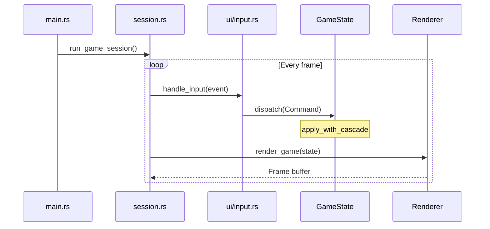
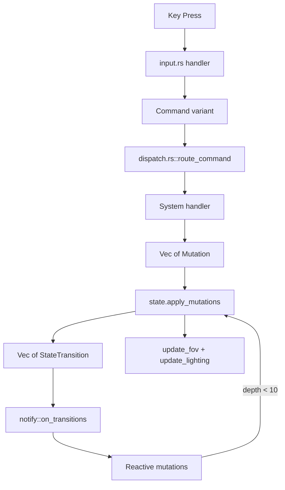
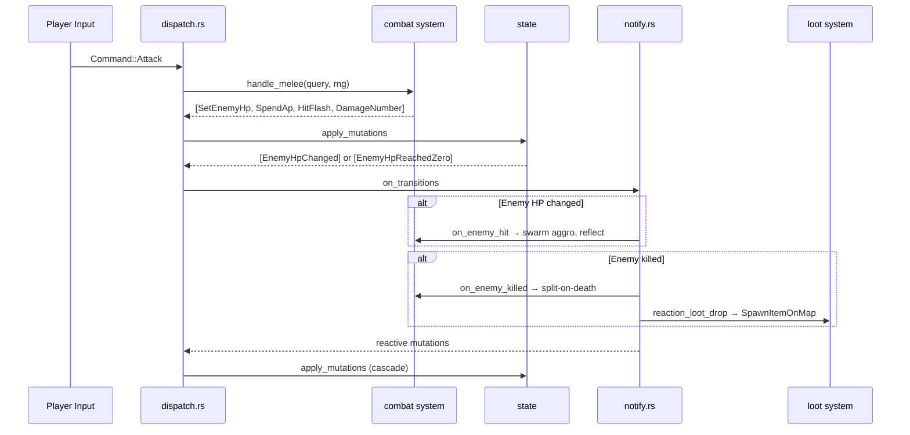
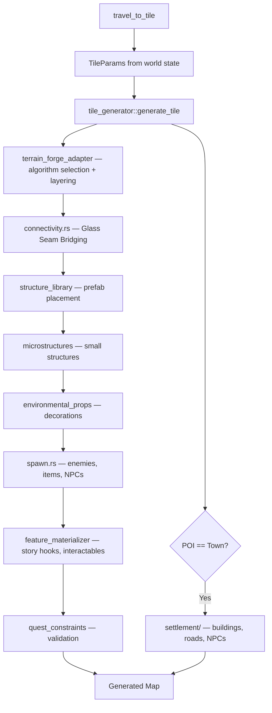
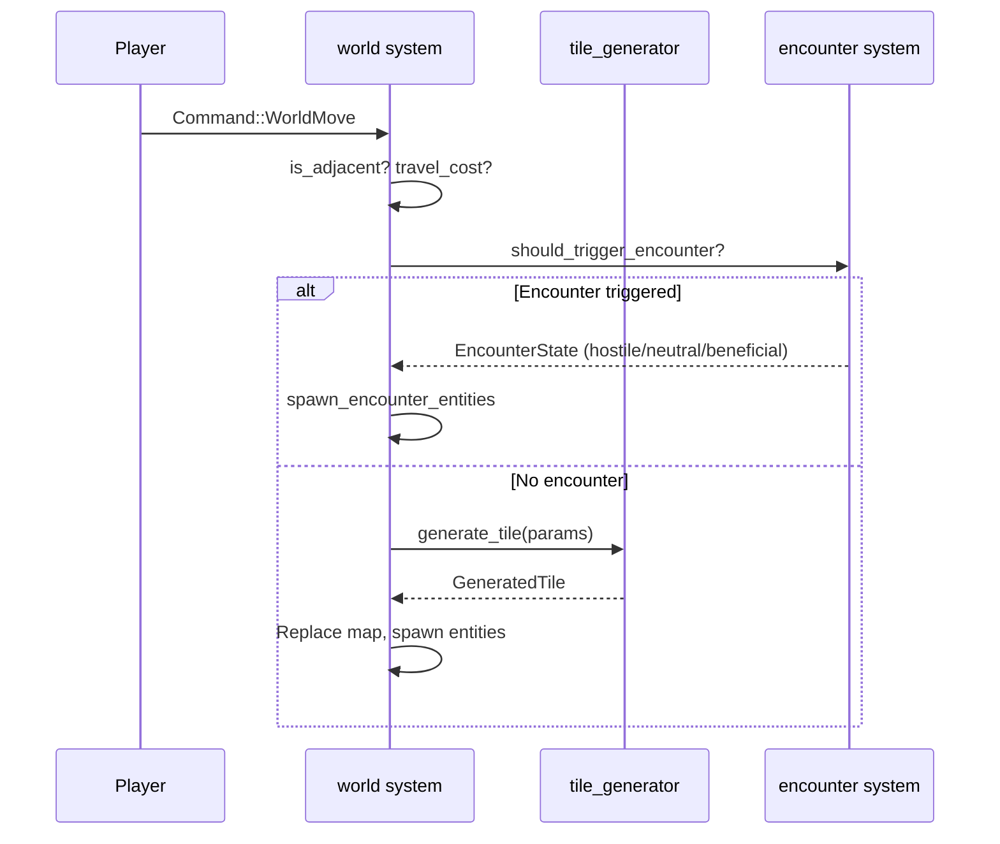
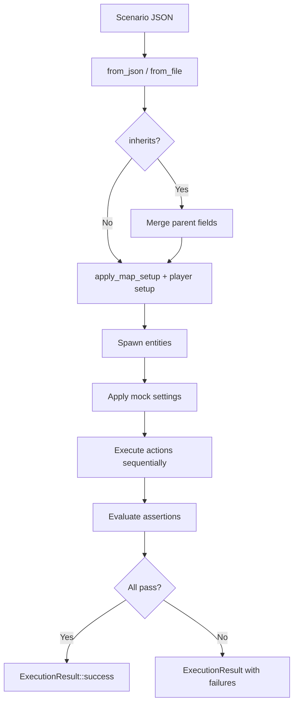
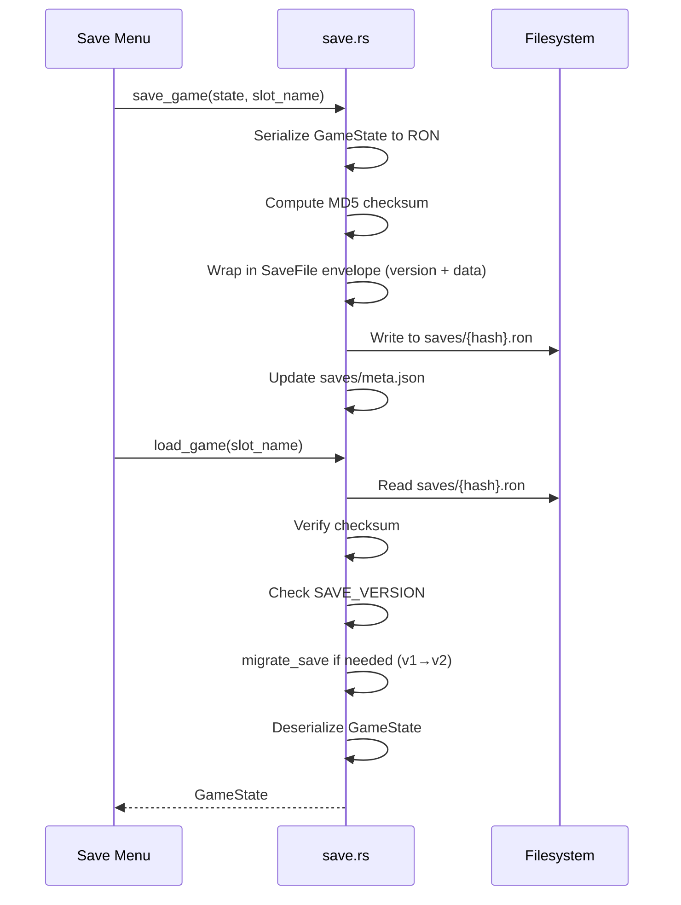
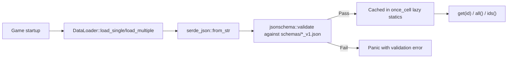
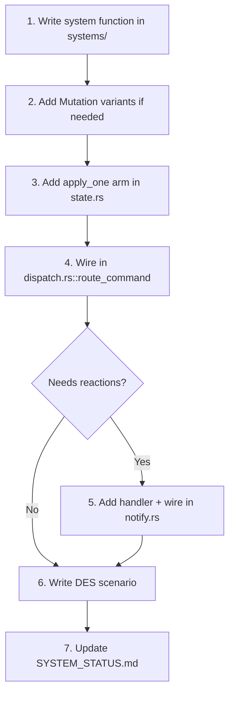

# Workflows

<!-- Generated: 2026-04-06 | tags: workflows, processes, pipelines -->

## Game Loop

The main loop in `main.rs` runs at configurable FPS (default 60). Each frame: poll input → dispatch commands → render. The game is turn-based — rendering happens every frame but state only changes on player actions.

## Command Dispatch Flow

## Combat Flow

## Turn Processing Flow

```mermaid
flowchart LR
    ET[EndTurn mutation] --> P1[ResetAp]
    P1 --> P2[TickStatusEffects]
    P2 --> P3["TickSubsystems (psychic, skills, light, void, crystal)"]
    P3 --> P4[AdvanceTurn]
    P4 --> P5["RunAI (all enemies act)"]
    P5 --> P6["TickStorm (map edits, wraith spawns)"]
    P6 --> P7["AdvanceTime (time_of_day, weather)"]
    P7 --> P8["UpdateDerives (FOV, lighting)"]
    P8 --> P9["CheckEncounters (overworld only)"]
```

Each phase produces mutations that are applied immediately. AI phase runs all enemies sequentially with spatial index rebuilds between actions.

## Tile Generation Pipeline

## World Travel Flow

## DES Test Execution Flow

## Save/Load Flow

## Data Loading Flow

Data files are loaded once at startup via `include_str!` (compile-time embedding) or `fs::read_to_string` (runtime). Schema validation catches structural errors immediately.

## Adding a New Gameplay System

