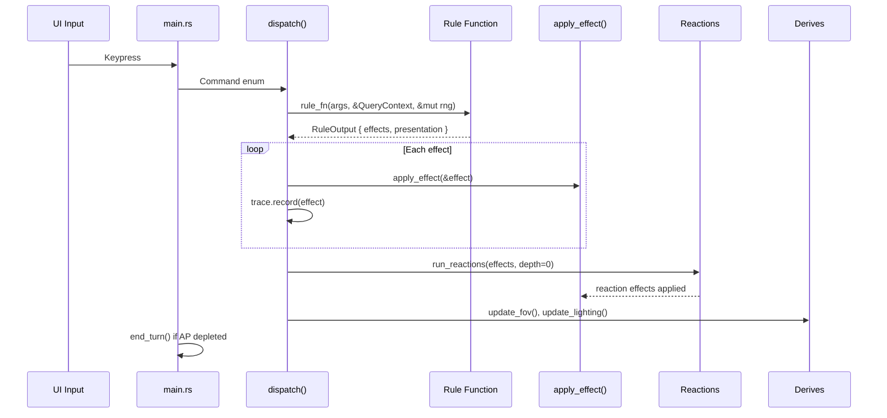
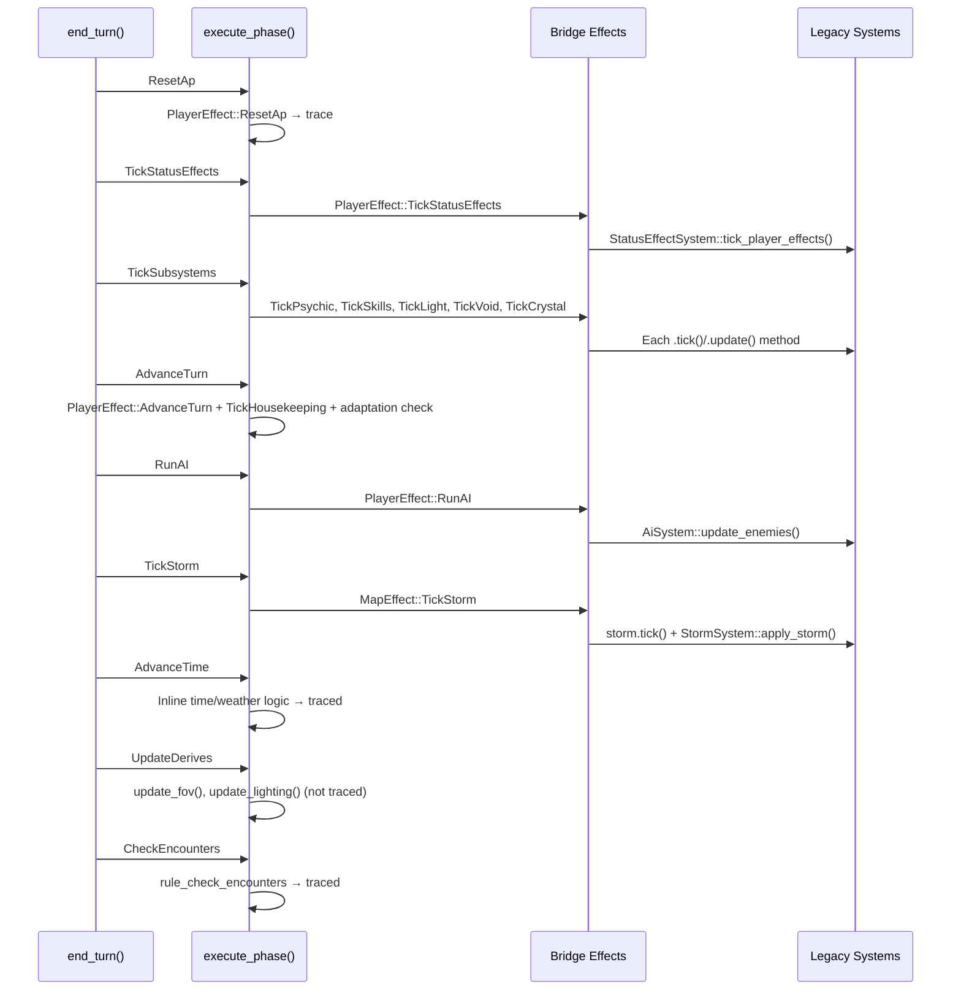
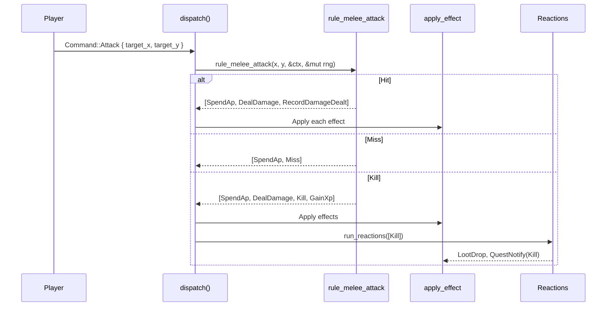
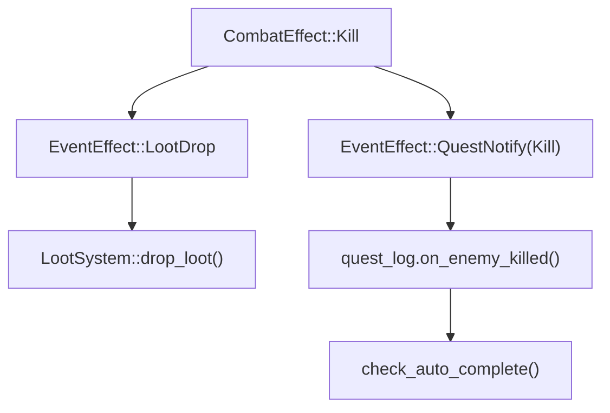
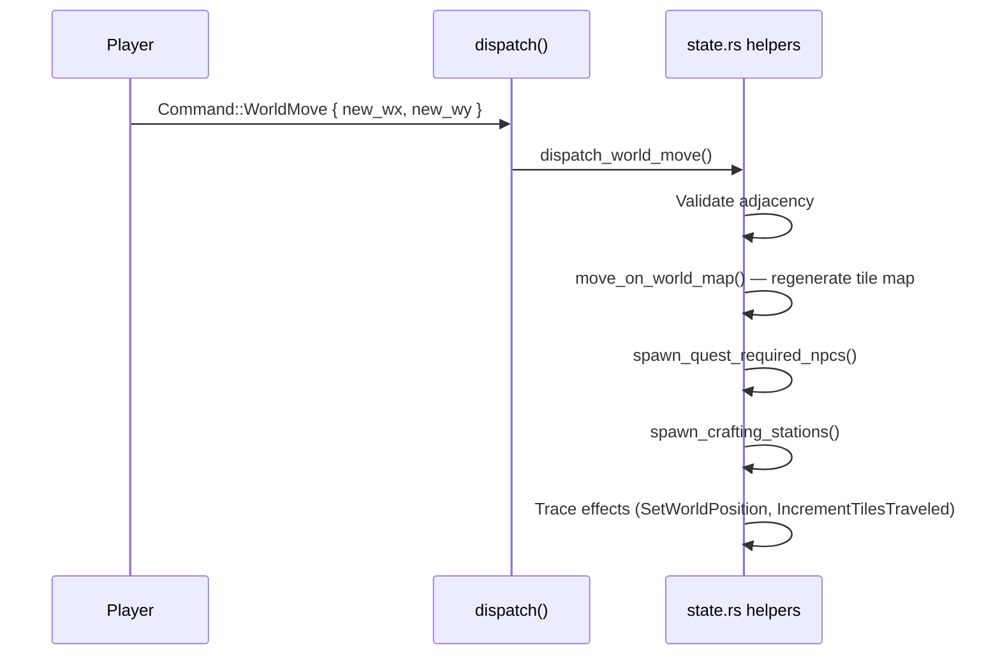
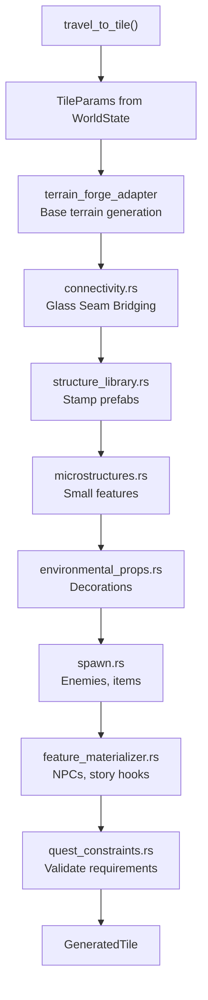
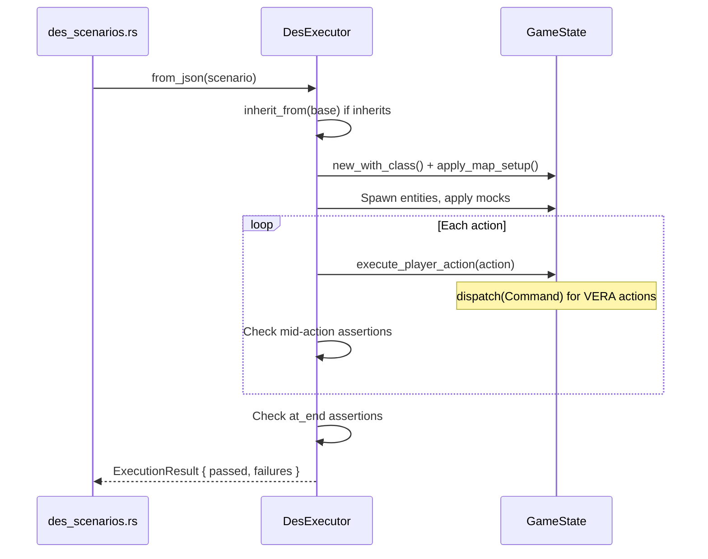
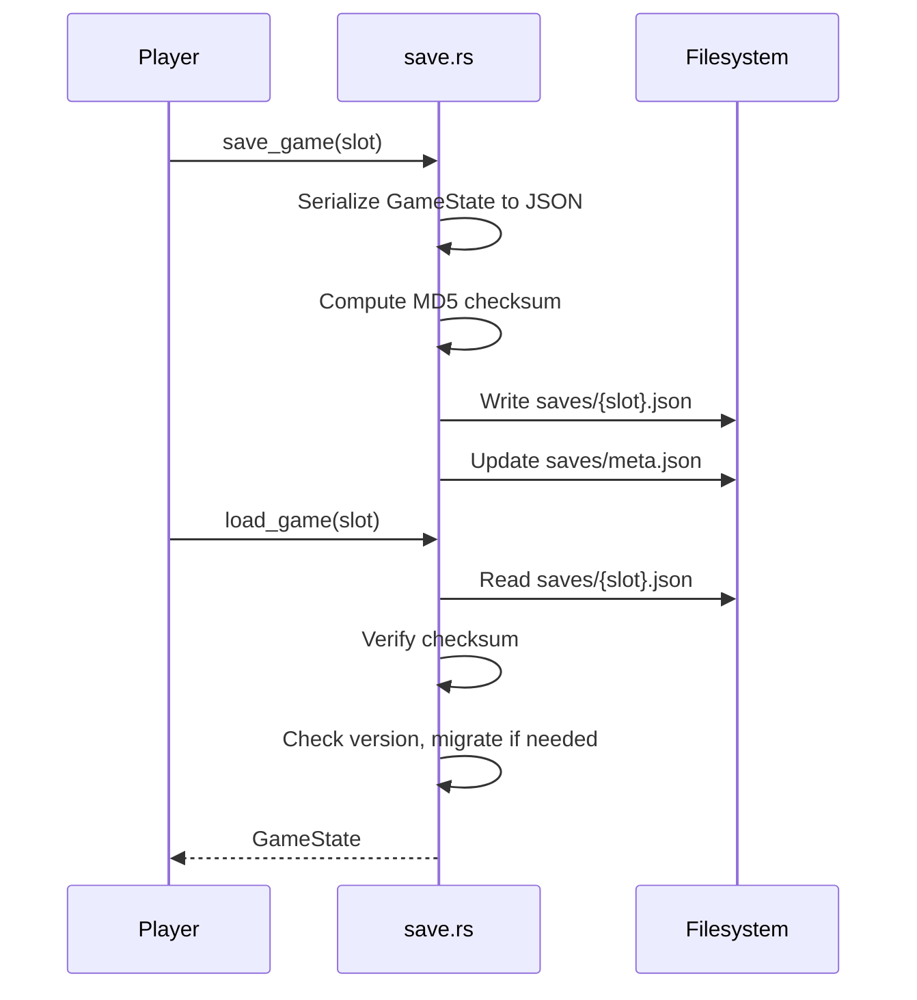
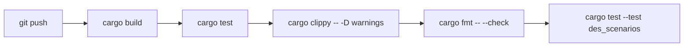

# Workflows

## Player Action Flow

## End-of-Turn Flow

## Combat Flow

## Reaction Chain (Post-Batch F)

Reactions replace the old `GameEvent` system. Max depth: 10.

## World Travel Flow

## Map Generation Flow

## DES Test Execution Flow

## Save/Load Flow

## CI Pipeline

