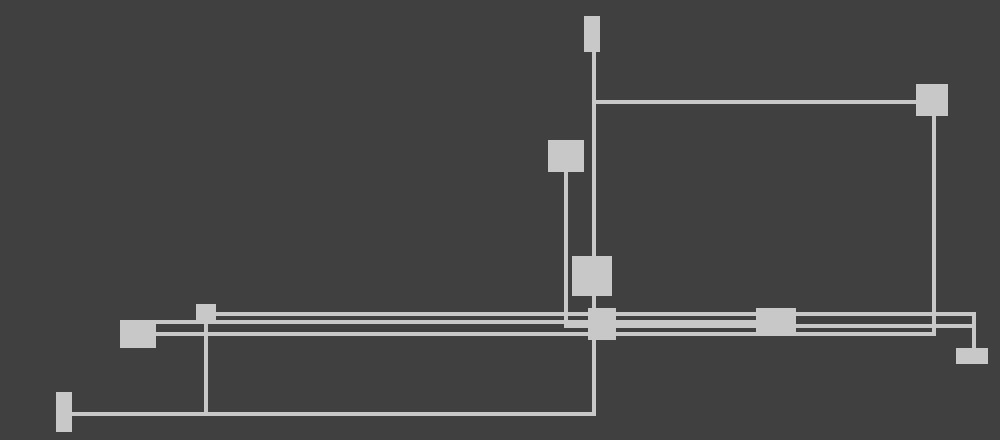
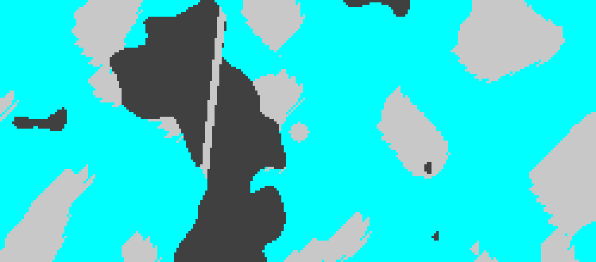
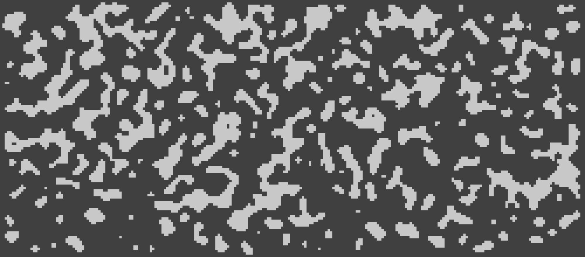
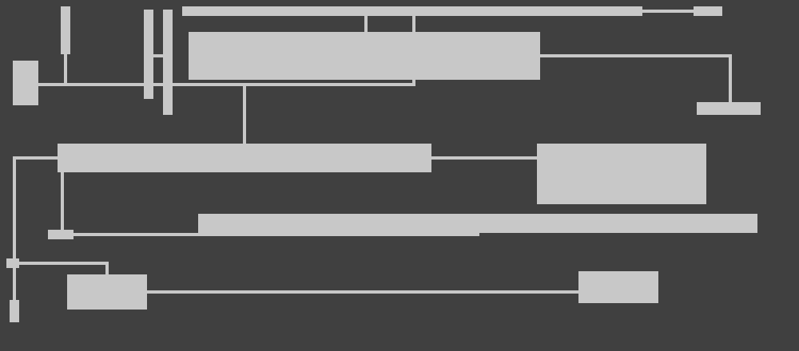
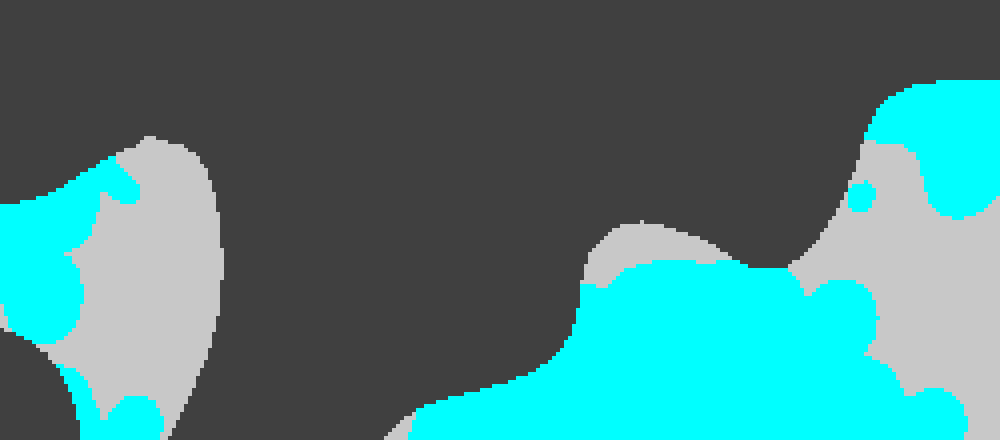

# Enhanced Tile Generation Test Report

**Generated:** 2026-01-10 16:41:07 UTC

## Test Results

| Test | Status | Quality Score | Constraints | PNG | Evaluation |
|------|--------|---------------|-------------|-----|------------|
| saltflat_basic | ✅ PASS | 0.646 | 1/2 |  | [JSON](evaluations/2001_evaluation.json) |
| desert_town | ✅ PASS | 0.528 | 1/2 |  | [JSON](evaluations/2002_evaluation.json) |
| ruins_landmark | ✅ PASS | 0.687 | 2/2 |  | [JSON](evaluations/2003_evaluation.json) |
| oasis_shrine | ✅ PASS | 0.637 | 1/2 |  | [JSON](evaluations/2004_evaluation.json) |
| scrubland_dungeon | ✅ PASS | 0.625 | 1/2 |  | [JSON](evaluations/2005_evaluation.json) |
| high_glass_density | ✅ PASS | 0.635 | 1/2 |  | [JSON](evaluations/2006_evaluation.json) |

## Pipeline Stages

Each test validates the following pipeline stages:

1. **Noise Generation** - Multi-layer Perlin noise sampling
2. **Terrain Classification** - Floor/wall/glass assignment
3. **Biome Modification** - Biome-specific adjustments
4. **POI Integration** - Point of interest features
5. **Constraint Validation** - Connectivity and quality checks

## Quality Metrics

- **Quality Score**: Combined connectivity and floor density score (0.0-1.0)
- **Constraints**: Validation checks for connectivity, density, and accessibility
- **Pipeline Stages**: Specific generation phases tested per configuration
