# Tile Generation Sample Library

This library contains examples of procedural tile generation using the Saltglass Steppe tile generation testing framework. Each sample demonstrates different combinations of biomes, terrain types, POI structures, and generation layers.

## Dungeon Generation Samples

### BSP Small Structured Dungeon
**Configuration:** `dungeon_bsp_small.json`  
**Seed:** 7001  
**Features:** Small rooms with clear BSP structure, minimal organic influence  
**Sample Output:** [dungeon_bsp_small_sample.txt](text/dungeon_bsp_small_sample.txt)

### Organic Cave Dungeon  
**Configuration:** `dungeon_organic_cave.json`  
**Seed:** 7002  
**Features:** Heavy cellular automata influence creating organic cave-like structures  
**Sample Output:** [dungeon_organic_cave_sample.txt](text/dungeon_organic_cave_sample.txt)

### Balanced Hybrid Dungeon
**Configuration:** `dungeon_balanced_hybrid.json`  
**Seed:** 7003  
**Features:** Balanced combination of BSP structure with moderate organic influence  
**Sample Output:** [dungeon_balanced_hybrid_sample.txt](text/dungeon_balanced_hybrid_sample.txt)

## Terrain Generation Samples

## Sample 1001 - Saltflat Flat Terrain (Basic)
- **Seed**: 1001
- **Biome**: Saltflat
- **Terrain**: Flat
- **POI**: None
- **Size**: 80x40
- **Layers**: All (base_terrain, microstructures, entity_spawns, loot_placement, narrative_elements)

| Layer | PNG | Text |
|-------|-----|------|
| Base Terrain | 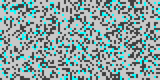 | [text/1001_base_terrain.txt](text/1001_base_terrain.txt) |
| Microstructures |  | [text/1001_microstructures.txt](text/1001_microstructures.txt) |
| Entity Spawns |  | [text/1001_entity_spawns.txt](text/1001_entity_spawns.txt) |
| Loot Placement | 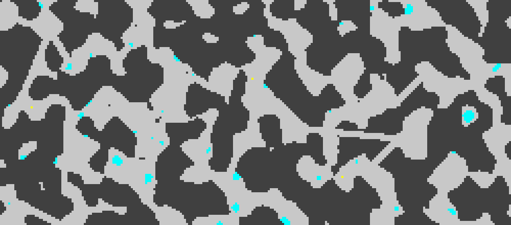 | [text/1001_loot_placement.txt](text/1001_loot_placement.txt) |
| Narrative Elements |  | [text/1001_narrative_elements.txt](text/1001_narrative_elements.txt) |

## Sample 2001 - Desert Hills Town
- **Seed**: 2001
- **Biome**: Desert
- **Terrain**: Hills
- **POI**: Town
- **Size**: 80x40
- **Layers**: All (base_terrain, poi_structures, microstructures, entity_spawns, loot_placement, narrative_elements)

| Layer | PNG | Text |
|-------|-----|------|
| Base Terrain | 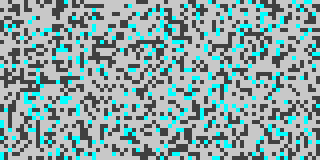 | [text/2001_base_terrain.txt](text/2001_base_terrain.txt) |
| POI Structures |  | [text/2001_poi_structures.txt](text/2001_poi_structures.txt) |
| Microstructures | 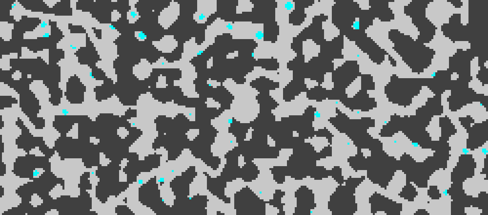 | [text/2001_microstructures.txt](text/2001_microstructures.txt) |
| Entity Spawns |  | [text/2001_entity_spawns.txt](text/2001_entity_spawns.txt) |
| Loot Placement |  | [text/2001_loot_placement.txt](text/2001_loot_placement.txt) |
| Narrative Elements |  | [text/2001_narrative_elements.txt](text/2001_narrative_elements.txt) |

## Sample 3001 - Ruins Canyon Shrine
- **Seed**: 3001
- **Biome**: Ruins
- **Terrain**: Canyon
- **POI**: Shrine
- **Size**: 80x40
- **Layers**: All (base_terrain, poi_structures, microstructures, entity_spawns, loot_placement, narrative_elements)

| Layer | PNG | Text |
|-------|-----|------|
| Base Terrain |  | [text/3001_base_terrain.txt](text/3001_base_terrain.txt) |
| POI Structures |  | [text/3001_poi_structures.txt](text/3001_poi_structures.txt) |
| Microstructures | 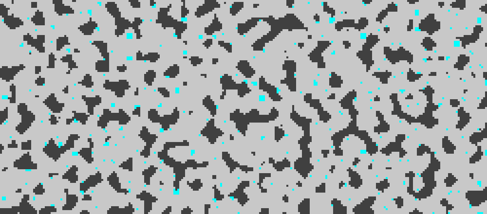 | [text/3001_microstructures.txt](text/3001_microstructures.txt) |
| Entity Spawns | 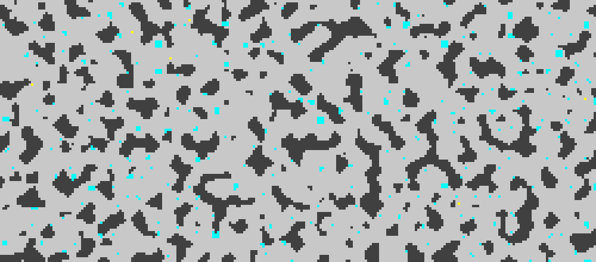 | [text/3001_entity_spawns.txt](text/3001_entity_spawns.txt) |
| Loot Placement |  | [text/3001_loot_placement.txt](text/3001_loot_placement.txt) |
| Narrative Elements |  | [text/3001_narrative_elements.txt](text/3001_narrative_elements.txt) |

## Sample 4001 - Scrubland Mesa Dungeon
- **Seed**: 4001
- **Biome**: Scrubland
- **Terrain**: Mesa
- **POI**: Dungeon
- **Size**: 80x40
- **Layers**: All (base_terrain, poi_structures, microstructures, entity_spawns, loot_placement, narrative_elements)

| Layer | PNG | Text |
|-------|-----|------|
| Base Terrain | 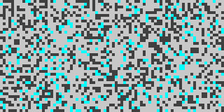 | [text/4001_base_terrain.txt](text/4001_base_terrain.txt) |
| POI Structures |  | [text/4001_poi_structures.txt](text/4001_poi_structures.txt) |
| Microstructures | 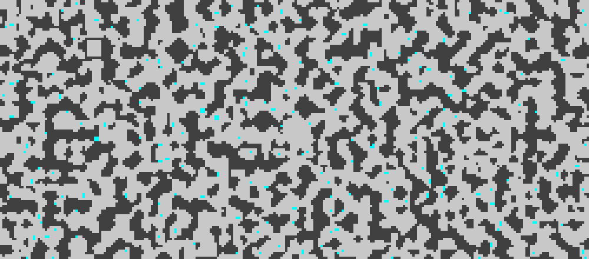 | [text/4001_microstructures.txt](text/4001_microstructures.txt) |
| Entity Spawns | 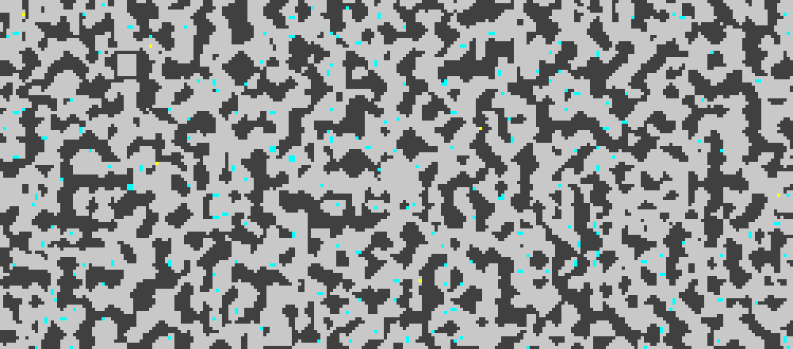 | [text/4001_entity_spawns.txt](text/4001_entity_spawns.txt) |
| Loot Placement | 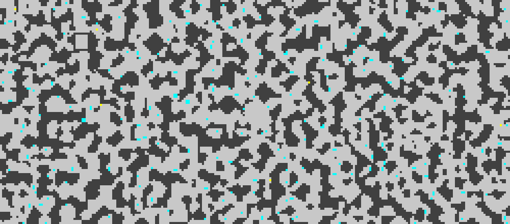 | [text/4001_loot_placement.txt](text/4001_loot_placement.txt) |
| Narrative Elements |  | [text/4001_narrative_elements.txt](text/4001_narrative_elements.txt) |

## Sample 5001 - Oasis Dunes Landmark (Large)
- **Seed**: 5001
- **Biome**: Oasis
- **Terrain**: Dunes
- **POI**: Landmark
- **Size**: 120x60 (Large)
- **Layers**: All (base_terrain, poi_structures, microstructures, entity_spawns, loot_placement, narrative_elements)

| Layer | PNG | Text |
|-------|-----|------|
| Base Terrain | 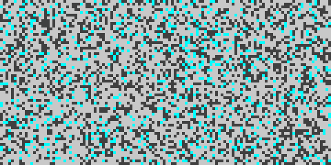 | [text/5001_base_terrain.txt](text/5001_base_terrain.txt) |
| POI Structures | 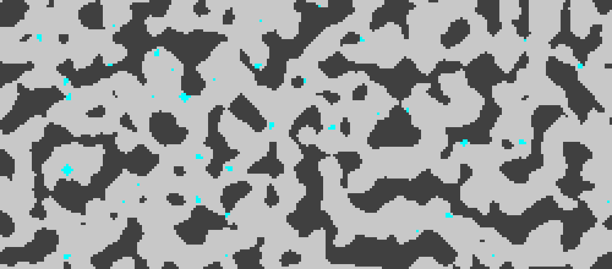 | [text/5001_poi_structures.txt](text/5001_poi_structures.txt) |
| Microstructures |  | [text/5001_microstructures.txt](text/5001_microstructures.txt) |
| Entity Spawns |  | [text/5001_entity_spawns.txt](text/5001_entity_spawns.txt) |
| Loot Placement | 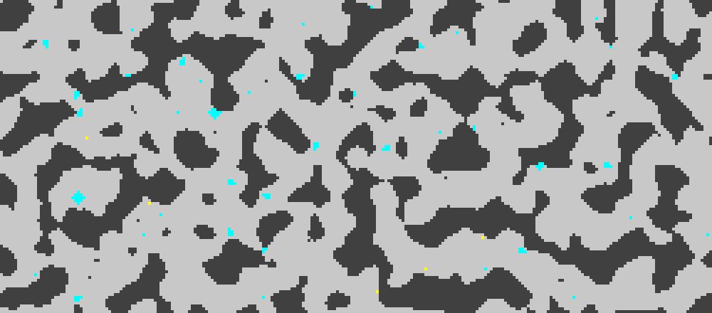 | [text/5001_loot_placement.txt](text/5001_loot_placement.txt) |
| Narrative Elements |  | [text/5001_narrative_elements.txt](text/5001_narrative_elements.txt) |

## Sample 6001 - Desert Minimal (Selective Layers)
- **Seed**: 6001
- **Biome**: Desert
- **Terrain**: Flat
- **POI**: None
- **Size**: 80x40
- **Layers**: Selective (base_terrain, entity_spawns only)
- **Options**: No microstructures, No loot

| Layer | PNG | Text |
|-------|-----|------|
| Base Terrain | 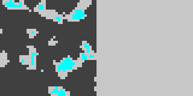 | [text/6001_base_terrain.txt](text/6001_base_terrain.txt) |
| Entity Spawns | 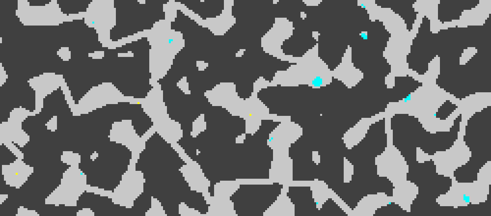 | [text/6001_entity_spawns.txt](text/6001_entity_spawns.txt) |

## Legend

### Tile Types (PNG Colors)
- **Dark Gray**: Walls (various types: sandstone, shale, salt_crystal, stone_brick, rubble)
- **Light Gray**: Floor tiles (various types: dry_soil, cobblestone, marble)
- **Cyan**: Glass shards (dangerous terrain and loot markers)
- **Yellow**: Glare tiles (spawn point markers)

### Generation Layers
1. **Base Terrain**: Core map structure with walls, floors, and glass using noise generation
2. **POI Structures**: Point of Interest features (town clearings, shrine areas, dungeon chambers)
3. **Microstructures**: Small environmental details and obstacles (rubble, debris)
4. **Entity Spawns**: Placement markers for enemies and NPCs (glare tiles)
5. **Loot Placement**: Additional loot containers and items (extra glass shards)
6. **Narrative Elements**: Story fragments and atmospheric elements (currently copies previous layer)

### Biome Types
- **Saltflat**: Basic crystalline desert environment
- **Desert**: Sandy wasteland with dunes
- **Ruins**: Ancient structures and debris
- **Scrubland**: Sparse vegetation and rocky terrain
- **Oasis**: Water sources and lush areas

### POI Types
- **Town**: Central cobblestone clearing (7x7 area)
- **Shrine**: Marble floor sacred area (5x5 area)
- **Dungeon**: Stone brick chamber walls (9x9 perimeter)
- **Landmark**: Ruins and ancient structures

## Usage

To generate your own samples, use the tilegen-test-tool:

```bash
# Basic generation
cargo run --bin tilegen-test-tool -- --seed 1234 --biome desert --poi town --format both

# Advanced generation with custom parameters
cargo run --bin tilegen-test-tool -- --seed 5678 --biome ruins --terrain canyon --poi shrine --width 100 --height 50 --layers base_terrain,poi_structures,entity_spawns --format png
```
