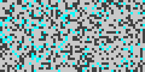
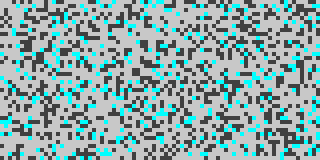
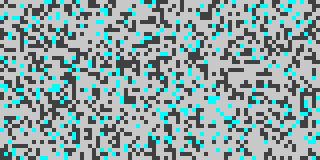
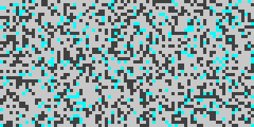
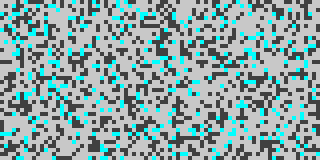
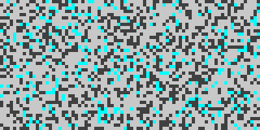
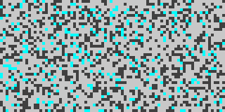

# Tile Generation Sample Library

This library demonstrates the capabilities of the tile generation system across different biomes, terrain types, and Points of Interest (POI).

## Generation Parameters

Each sample is generated using a JSON configuration file that specifies:
- **Seed**: Deterministic random seed for reproducible results
- **Dimensions**: Width and height of the generated tile map
- **Biome**: Environmental theme (saltflat, desert, ruins, scrubland, oasis)
- **Terrain**: Topographical features (flat, hills, canyon, mesa, dunes)
- **POI**: Point of Interest structures (town, shrine, landmark, dungeon, or null)
- **Output Layers**: Which generation phases to include in output

## Samples

### bsp_test

**Configuration:**
```json
{
  "name": "BSP Algorithm Test",
  "description": "Test BSP algorithm for room generation",
  "seed": 9001,
  "width": 60,
  "height": 30,
  "output_dir": "tile-generation-sample-library"
}
```

**base_terrain Layer:**


---

### cellular_automata_test

**Configuration:**
```json
{
  "name": "Cellular Automata Test", 
  "description": "Test cellular automata for cave generation",
  "seed": 9002,
  "width": 80,
  "height": 40,
  "output_dir": "tile-generation-sample-library"
}
```

**base_terrain Layer:**


---

### desert_minimal

**Configuration:**
```json
{
  "seed": 6001,
  "width": 80,
  "height": 40,
  "biome": "desert",
  "terrain_type": "flat",
  "poi_type": null,
  "quest_tile": false,
  "enable_microstructures": false,
  "enable_spawns": true,
  "enable_loot": false,
  "enable_narrative": false,
  "custom_biome_attributes": {},
  "output_layers": ["base_terrain", "entity_spawns"],
  "output_format": ["text", "png"],
  "output_dir": "tile-generation-sample-library"
}
```

**base_terrain Layer:**


---

### desert_town

**Configuration:**
```json
{
  "seed": 2001,
  "width": 80,
  "height": 40,
  "biome": "desert",
  "terrain_type": "hills",
  "poi_type": "town",
  "quest_tile": false,
  "enable_microstructures": true,
  "enable_spawns": true,
  "enable_loot": true,
  "enable_narrative": false,
  "custom_biome_attributes": {},
  "output_layers": ["base_terrain", "poi_structures", "microstructures", "entity_spawns", "loot_placement"],
  "output_format": ["text", "png"],
  "output_dir": "tile-generation-sample-library"
}
```

**base_terrain Layer:**


---

### dungeon_balanced_hybrid

**Configuration:**
```json
{
  "name": "Balanced Hybrid Dungeon",
  "description": "Balanced combination of BSP structure with moderate organic influence",
  "generator": "DungeonGenerator",
  "seed": 7003,
  "parameters": {
    "width": 80,
    "height": 40,
    "min_room_size": [6, 6],
    "max_room_size": [12, 10],
    "corridor_width": 3,
    "max_depth": 4,
    "split_ratio_min": 0.35,
    "split_ratio_max": 0.65,
    "initial_wall_probability": 0.45,
    "ca_iterations": 5,
    "survival_threshold": 4,
    "birth_threshold": 5,
    "use_moore_neighborhood": true,
    "organic_blend_factor": 0.35
  },
  "expected_features": [
    "Clear room structure from BSP",
    "Organic wall variations",
    "Good balance of structure and naturalism",
    "Reliable connectivity"
  ]
}
```

**base_terrain Layer:**


---

### dungeon_bsp_small

**Configuration:**
```json
{
  "name": "BSP Dungeon - Small Structured",
  "description": "Small dungeon with clear BSP room structure and minimal organic influence",
  "generator": "DungeonGenerator",
  "seed": 7001,
  "parameters": {
    "width": 40,
    "height": 20,
    "min_room_size": [4, 4],
    "max_room_size": [8, 6],
    "corridor_width": 2,
    "max_depth": 3,
    "split_ratio_min": 0.35,
    "split_ratio_max": 0.65,
    "initial_wall_probability": 0.45,
    "ca_iterations": 3,
    "survival_threshold": 4,
    "birth_threshold": 5,
    "use_moore_neighborhood": true,
    "organic_blend_factor": 0.15
  },
  "expected_features": [
    "Clear room separation",
    "Structured corridors",
    "Minimal organic walls",
    "Good connectivity"
  ]
}
```

**base_terrain Layer:**


---

### dungeon_organic_cave

**Configuration:**
```json
{
  "name": "Organic Cave Dungeon - Heavy CA",
  "description": "Dungeon with heavy cellular automata influence creating organic cave-like structures",
  "generator": "DungeonGenerator", 
  "seed": 7002,
  "parameters": {
    "width": 60,
    "height": 30,
    "min_room_size": [6, 6],
    "max_room_size": [10, 8],
    "corridor_width": 3,
    "max_depth": 4,
    "split_ratio_min": 0.3,
    "split_ratio_max": 0.7,
    "initial_wall_probability": 0.5,
    "ca_iterations": 6,
    "survival_threshold": 4,
    "birth_threshold": 5,
    "use_moore_neighborhood": true,
    "organic_blend_factor": 0.7
  },
  "expected_features": [
    "Organic cave-like walls",
    "Natural-looking chambers",
    "Irregular corridors",
    "BSP structure preserved for connectivity"
  ]
}
```

**base_terrain Layer:**


---

### modular_perlin_enhanced

**Configuration:**
```json
{
  "name": "Modular Architecture - Perlin Noise Enhanced",
  "description": "Demonstrates new modular architecture with enhanced Perlin noise generation",
  "algorithm": "PerlinNoiseAlgorithm",
  "seed": 8001,
  "parameters": {
    "width": 80,
    "height": 40,
    "scale": 0.08,
    "octaves": 4,
    "persistence": 0.6,
    "lacunarity": 2.1,
    "threshold": 0.1
  },
  "generation_passes": [
    {
      "algorithm_id": "perlin_noise",
      "input_layers": [],
      "output_layers": ["heightmap"],
      "parameters": {
        "scale": 0.08,
        "octaves": 4,
        "persistence": 0.6,
        "lacunarity": 2.1,
        "threshold": 0.1
      }
    }
  ],
  "expected_features": [
    "Multi-octave noise generation",
    "Modular algorithm architecture",
    "Configurable parameters",
    "Enhanced terrain detail"
  ]
}
```

**base_terrain Layer:**


---

### oasis_landmark

**Configuration:**
```json
{
  "seed": 5001,
  "width": 120,
  "height": 60,
  "biome": "oasis",
  "terrain_type": "dunes",
  "poi_type": "landmark",
  "quest_tile": false,
  "enable_microstructures": true,
  "enable_spawns": true,
  "enable_loot": true,
  "enable_narrative": false,
  "custom_biome_attributes": {},
  "output_layers": ["base_terrain", "poi_structures", "microstructures", "entity_spawns", "loot_placement"],
  "output_format": ["text", "png"],
  "output_dir": "tile-generation-sample-library"
}
```

**base_terrain Layer:**


---

### registry_multipass

**Configuration:**
```json
{
  "name": "Algorithm Registry - Multi-Pass Generation",
  "description": "Demonstrates algorithm registry with multiple generation passes",
  "algorithm": "PerlinNoiseAlgorithm",
  "seed": 8002,
  "parameters": {
    "width": 60,
    "height": 30,
    "scale": 0.12,
    "octaves": 2,
    "persistence": 0.4,
    "lacunarity": 2.0,
    "threshold": 0.2
  },
  "generation_passes": [
    {
      "algorithm_id": "perlin_noise",
      "input_layers": [],
      "output_layers": ["base_terrain"],
      "parameters": {
        "scale": 0.12,
        "octaves": 2,
        "persistence": 0.4,
        "lacunarity": 2.0,
        "threshold": 0.2
      }
    },
    {
      "algorithm_id": "perlin_noise", 
      "input_layers": ["base_terrain"],
      "output_layers": ["detail_layer"],
      "parameters": {
        "scale": 0.25,
        "octaves": 1,
        "persistence": 0.3,
        "lacunarity": 2.0,
        "threshold": 0.4
      }
    }
  ],
  "expected_features": [
    "Multi-pass generation pipeline",
    "Layer-based composition",
    "Algorithm registry usage",
    "Configurable pass parameters"
  ]
}
```

**base_terrain Layer:**


---

### ruins_shrine

**Configuration:**
```json
{
  "seed": 3001,
  "width": 80,
  "height": 40,
  "biome": "ruins",
  "terrain_type": "canyon",
  "poi_type": "shrine",
  "quest_tile": false,
  "enable_microstructures": true,
  "enable_spawns": true,
  "enable_loot": true,
  "enable_narrative": false,
  "custom_biome_attributes": {},
  "output_layers": ["base_terrain", "poi_structures", "microstructures", "entity_spawns", "loot_placement"],
  "output_format": ["text", "png"],
  "output_dir": "tile-generation-sample-library"
}
```

**base_terrain Layer:**


---

### saltflat_basic

**Configuration:**
```json
{
  "seed": 1001,
  "width": 80,
  "height": 40,
  "biome": "saltflat",
  "terrain_type": "flat",
  "poi_type": null,
  "quest_tile": false,
  "enable_microstructures": true,
  "enable_spawns": true,
  "enable_loot": true,
  "enable_narrative": false,
  "custom_biome_attributes": {},
  "output_layers": ["base_terrain", "microstructures", "entity_spawns", "loot_placement"],
  "output_format": ["text", "png"],
  "output_dir": "tile-generation-sample-library"
}
```

**base_terrain Layer:**


---

### scrubland_dungeon

**Configuration:**
```json
{
  "seed": 4001,
  "width": 80,
  "height": 40,
  "biome": "scrubland",
  "terrain_type": "mesa",
  "poi_type": "dungeon",
  "quest_tile": false,
  "enable_microstructures": true,
  "enable_spawns": true,
  "enable_loot": true,
  "enable_narrative": false,
  "custom_biome_attributes": {},
  "output_layers": ["base_terrain", "poi_structures", "microstructures", "entity_spawns", "loot_placement"],
  "output_format": ["text", "png"],
  "output_dir": "tile-generation-sample-library"
}
```

**base_terrain Layer:**


---


## Usage

To regenerate any sample:

```bash
cd /path/to/saltglass-steppe
cargo run --bin tilegen-test-tool --config tile-generation-sample-library/config/SAMPLE_NAME.json
```

To regenerate the entire library:

```bash
cd tile-generation-sample-library
./generate_samples.sh
```

## File Structure

```
tile-generation-sample-library/
├── config/           # JSON configuration files
├── text/            # ASCII text output files
├── pngs/            # PNG image output files
├── generate_samples.sh  # This generation script
└── TILE_GEN_SAMPLE_LIB.md  # This documentation
```

